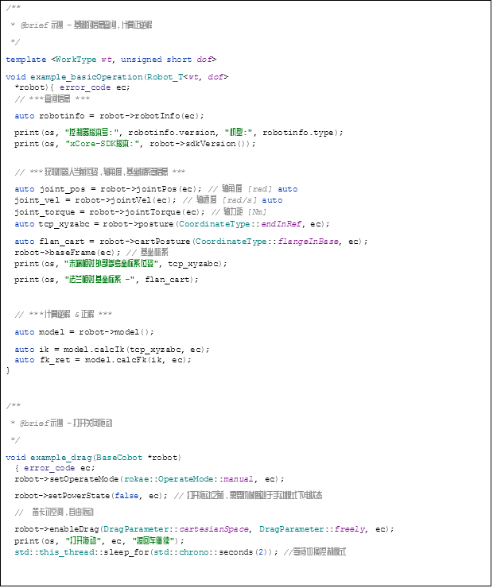
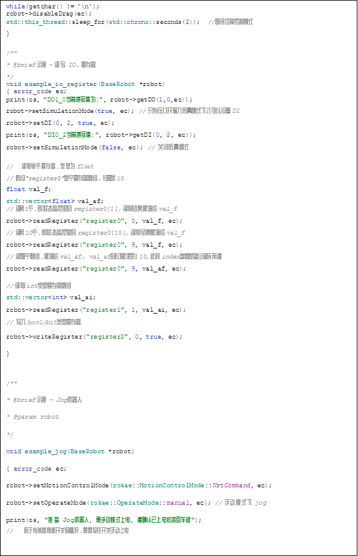
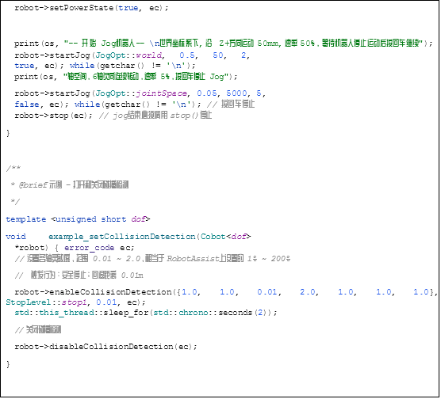
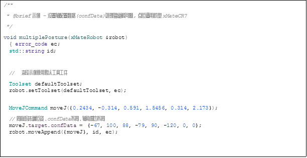
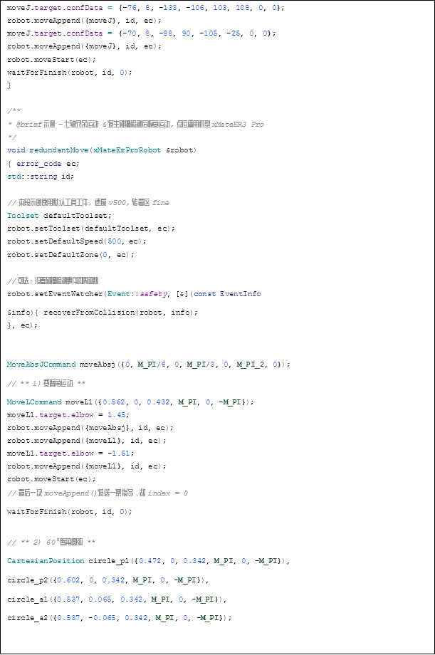
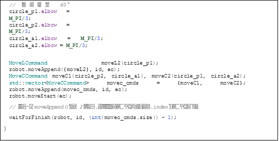
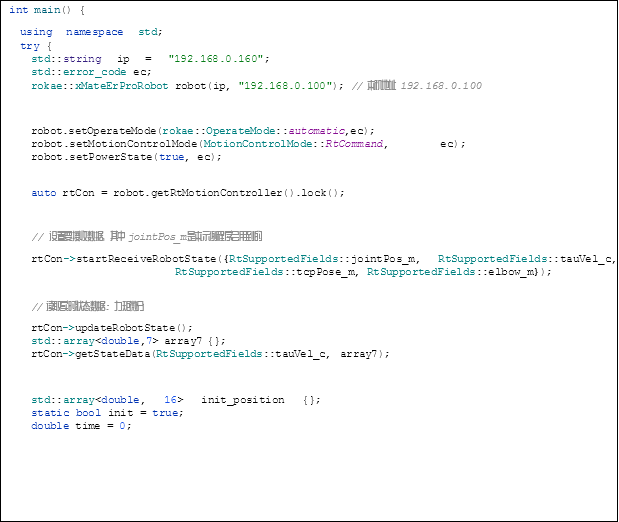
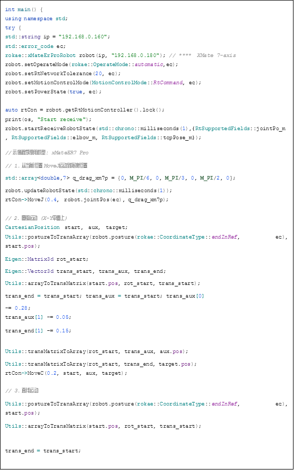
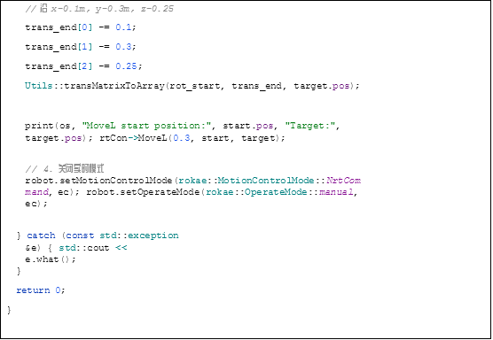



Robot SDK(C++)

使用手册

更新日期：2025年10月22日

# 目录
[1.前言	5](#_toc211499279)

[1.1关于本手册	5](#_toc211499280)

[1.2如何阅读产品手册	5](#_toc211499281)

[2.概述	6](#_toc211499282)

[2.1兼容性	6](#_toc211499283)

[2.1.1控制器版本和机器人型号	6](#_toc211499284)

[2.1.2编译平台及语言	6](#_toc211499285)

[2.2非实时控制	6](#_toc211499286)

[2.3实时控制	6](#_toc211499287)

[3.使用指南	7](#_toc211499288)

[3.1硬件设置	7](#_toc211499289)

[3.2网络设置	7](#_toc211499290)

[3.3机器人功能设置	7](#_toc211499291)

[3.4 xCore SDK工程包说明	7](#_toc211499292)

[3.5 C++编译	7](#_toc211499293)

[3.5.1 Windows平台编译	7](#_toc211499294)

[3.5.2 Linux平台编译	7](#_toc211499295)

[3.5.3 QT平台编译	8](#_toc211499296)

[3.5.4 Linux 实时环境配置（可选）	8](#_toc211499297)

[4.接口说明	11](#_toc211499298)

[4.1 API 支持	11](#_toc211499299)

[4.2 C++: 实例化 rokae::Robot 类	11](#_toc211499300)

[4.3机器人基本操作及信息查询	11](#_toc211499301)

[4.4运动控制	14](#_toc211499302)

[4.5实时运动控制	16](#_toc211499303)

[4.5.1参数设置	20](#_toc211499304)

[4.5.2发送运动指令	20](#_toc211499305)

[4.5.3获取实时数据	20](#_toc211499306)

[4.5.4运动学和动力学计算	20](#_toc211499307)

[4.5.5 S轨迹规划接口	21](#_toc211499308)

[4.5.6错误异常	21](#_toc211499309)

[4.6通信相关	24](#_toc211499310)

[4.7焊接相关	26](#_toc211499311)

[4.8 RL 工程	27](#_toc211499312)

[4.9协作相关	28](#_toc211499313)

[4.10错误码和异常	30](#_toc211499314)

[5. C++ API	31](#_toc211499315)

[5.1枚举类型	31](#_toc211499316)

[5.1.1机器人工作状态rokae::OperationState	31](#_toc211499317)

[5.1.2机型类别 rokae::WorkType	31](#_toc211499318)

[5.1.3机器人操作模式 rokae::OperateMode	31](#_toc211499319)

[5.1.4机器人上下电及急停状态rokae::PowerState	32](#_toc211499320)

[5.1.5位姿坐标系类型rokae:: CoordinateType	32](#_toc211499321)

[5.1.6运动控制模式rokae::MotionControlMode	32](#_toc211499322)

[5.1.7控制器实时控制模式 rokae::RtControllerMode	32](#_toc211499323)

[5.1.8机器人停止运动等级 rokae::StopLevel	33](#_toc211499324)

[5.1.9机器人拖动模式参数 rokae::DragParameter	33](#_toc211499325)

[5.1.10坐标系类型 rokae:: FrameType	33](#_toc211499326)

[5.1.11 Jog 选项 - 坐标系 rokae::JogOpt::Space	33](#_toc211499327)

[5.1.12 xPanel 配置: 对外供电模式 rokae::xPanelOpt::Vout	34](#_toc211499328)

[5.1.13 力矩类型 rokae::TorqueType	34](#_toc211499329)

[5.1.14 事件类型 rokae:: Event	34](#_toc211499330)

[5.1.15 奇异规避方式 rokae:: AvoidSingularityMethod	35](#_toc211499331)

[5.2数据结构	35](#_toc211499332)

[5.2.1 机器人基本信息 rokae::Info	35](#_toc211499333)

[5.2.2 坐标系 rokae::Frame	35](#_toc211499334)

[5.2.3 笛卡尔点位 rokae::CartesianPosition	35](#_toc211499335)

[5.2.4 笛卡尔点位偏移量 rokae::CartesianPosition::Offset	35](#_toc211499336)

[5.2.5 关节点位 rokae::JointPosition	35](#_toc211499337)

[5.2.6 关节扭矩, 不包含重力和摩擦力 rokae::Torque	36](#_toc211499338)

[5.2.7 负载信息 rokae::Load	36](#_toc211499339)

[5.2.8 工具工件组信息 rokae::Toolset	36](#_toc211499340)

[5.2.9 坐标系标定结果 rokae::FrameCalibrationResult	36](#_toc211499341)

[5.2.10 RL 工程信息 rokae::RLProjectInfo	36](#_toc211499342)

[5.2.11 工具/工件信息 rokae::WorkToolInfo	36](#_toc211499343)

[5.2.12 运动指令MoveAbsJ rokae::MoveAbsJCommand	36](#_toc211499344)

[5.2.13 运动指令MoveJ rokae::MoveJCommand	37](#_toc211499345)

[5.2.14 运动指令MoveL rokae::MoveLCommand	37](#_toc211499346)

[5.2.15 运动指令MoveC rokae::MoveCCommand	37](#_toc211499347)

[5.2.16 运动指令MoveCF rokae::MoveCFCommand	37](#_toc211499348)

[5.2.17 运动指令MoveSP rokae:: MoveSPCommand	37](#_toc211499349)

[5.2.18 控制器日志信息 rokae::LogInfo	38](#_toc211499350)

[5.3方法	38](#_toc211499351)

[5.3.1 机器人基本操作及信息查询	38](#_toc211499352)

[5.3.2 运动控制（非实时模式）	44](#_toc211499353)

[5.3.3 实时运动控制	49](#_toc211499354)

[5.3.4 通信相关	58](#_toc211499355)

[5.3.5 焊接相关	61](#_toc211499356)

[5.3.6 RL工程	63](#_toc211499357)

[5.3.7 协作相关	64](#_toc211499358)

[5.3.8 路径规划	68](#_toc211499359)

[5.3.9 运动学与动力学计算模型库	72](#_toc211499360)

[5.3.10 其他	77](#_toc211499361)

[6.使用示例	80](#_toc211499362)

[6.1非实时接口	80](#_toc211499363)

[6.1.1 示例一：机器人基本操作，信息查询，jog,拖动等	80](#_toc211499364)

[6.1.2 示例二：非实时运动指令	82](#_toc211499365)

[6.2实时运动控制	84](#_toc211499366)

[6.2.1 示例一：笛卡尔空间阻抗控制	84](#_toc211499367)

[6.2.2 示例二：上位机轨迹规划指令组合	86](#_toc211499368)

[7.注意事项及问题排查	88](#_toc211499369)

[7.1与RobotAssist同时使用	88](#_toc211499370)

[7.2兼容 RCI 客户端	88](#_toc211499371)

[7.2.1首次使用	88](#_toc211499372)

[7.2.2 切换到使用RCI 客户端	88](#_toc211499373)

[7.3实时指令	88](#_toc211499374)

[7.3.1 轴空间运动	88](#_toc211499375)

[7.3.2 笛卡尔空间运动	89](#_toc211499376)

[7.3.3 力矩直接控制	89](#_toc211499377)

[7.4问题排查	89](#_toc211499378)

[7.4.1 网络连接问题	89](#_toc211499379)

[7.4.2 实时模式直接力矩控制下坠问题	89](#_toc211499380)

# **1.前言**
## **1.1关于本手册**
感谢您购买本公司的机器人系统。

本手册记载了正确安装使用机器人的以下说明：

- **机器人二次开发接口SDK(C++)的使用。**

安装使用该机器人系统前，请仔细阅读本手册与其他相关手册。

阅读之后，请妥善保管，以便随时取阅。

## **1.2如何阅读产品手册**
配套相关手册包含单独的安全章节，必须确认在阅读相关手册安全章节后，才能进行安装或维护作业。

# **2.概述**
xCore SDK 编程接口库是Revopoint机器人提供给客户用于二次开发的软件产品，通过编程接口库，客户可以对配套了 xCore 系统的机器人进行一系列控制和操作，包括实时和非实时的运动控制，机器人通信相关的读写操作，查询及运行RL工程等等。该使用说明书主要介绍编程接口库的使用方法，以及各接口函数的功能。用户可编写自己的应用程序，集成到外部软硬件模块中。

## **2.1兼容性**
### **2.1.1控制器版本和机器人型号**
- 控制器版本：xCore v2.1 及以后。
- 机器人型号：支持控制所有机型，根据协作机器人支持的功能不同，可调用的接口有所差别。

### **2.1.2编译平台及语言**

|操作系统|编译器|平台|语言|
| :-: | :-: | :-: | :-: |
|Ubuntu 18.04/20.04/22.04|build-essential|X86\_64|C++,|
|Windows 10|MSVC 14.1+|X86\_64|C++, |

## **2.2非实时控制**
xCore SDK 提供对机器人的非实时控制：

主要通过给机器人发送运动指令，使用控制器内部的轨迹规划，完成路径规划和运动执行。

非实时模式提供的操作有：

- 轴空间运动（MoveAbsJ, MoveJ）
- 笛卡尔空间运动（MoveL, MoveC, MoveCF, MoveSP）
- 机器人通信: 数字量和模拟量 I/O，寄存器读写
- RL 工程的查询与执行
- 拖动与路径回放（只针对协作机器人）
- 其他操作：设置碰撞检测，软限位，清除报警，查询控制器日志等等

## **2.3实时控制**
xCore SDK 提供对机器人的实时控制：

主要包含了一系列底层控制接口，科研或二次开发用户可以使用该软件包实现最高达 1KHz 的实时控制，用于算法验证以及新应用的开发。

协作机器人支持 5 种控制模式：

•	轴空间位置控制

•	笛卡尔空间位置控制

•	轴空间阻抗控制

•	笛卡尔空间阻抗控制

•	直接力矩控制

# **3.使用指南**
本章介绍如何配置并运行一个 xCore SDK C++程序。

## **3.1硬件设置**
关于机器人本体和控制柜等硬件的设置，请参考《机器人用户操作手册》进行配置使用。除网络配置外，使用 xCore SDK 无需其他额外的硬件设置。

## **3.2网络设置**
xCore SDK 通过以太网（TCP/IP）连接机器人。通过有线或无线连接皆可，使用户 PC 和机器人连接同一局域网。

- 如果只使用非实时控制，对于网络性能要求不高，可以通过无线连接。
- 如果使用实时控制的话对于网络性能要求较高，推荐通过有线直连到机器人。
- 机器人配置有 2 个网口，一个是外网口，一个是直连网口。直连网口默认静态 IP 地址是 192.168.0.160。

连接机器人有两种方式：

- 连接方式1：机器人与用户 PC 采用网线直连的方式连接。如果用户工控机与机器人不处于同一个网段，需要配置用户 PC 的 IP 使其与机器人静态 IP 地址处于同一个网段，例如 192.168.0.22。
- 连接方式2：机器人外网口连接路由器或者交换机，用户 PC 也连接路由器WiFi，两者处于同一局域网进行无线连接。

注：推荐使用方式1进行连接，连接方式2在网络通信质量差时可能会造成机器人运动不稳定现象。

## **3.3机器人功能设置**
无需通过 **RobotAssist** 进行任何设置，用户可直接用 xCore SDK 控制机器人。

切换到实时模式后，机器人重启后会保持打开状态，并自动切换成自动模式。

## **3.4 xCore SDK工程包说明**
librokae

├── doc: 文档和使用手册

├── example: 示例程序

├── external:  Eigen

├── include: 头文件

└── lib: 各操作系统和架构的库文件

## **3.5 C++编译**
xCore SDK 版本使用 CMake 构建工程，CMake 版本不低于 3.12。

### **3.5.1 Windows平台编译**
- 下载安装 Microsoft Visual Studio 2017 或以后版本，选择安装“使用C++的桌面应用”。
- 打开 CMake 工程，选择根目录下的CMakeLists.txt。
- 选择编译 Release 或 Debug，编译示例程序。

### **3.5.2 Linux平台编译**
以编译示例程序 sdk\_example 为例，设置安装路径为根目录下 out:

cd librokae

mkdir build && cd build

cmake .. -DCMAKE\_INSTALL\_PREFIX=../out 

cmake --build . --target sdk\_example 

cmake --build . --target install

### **3.5.3 QT平台编译**
1\. 下载并安装 Qt 5.15.2 或以后版本，并将编译器勾选为MSVC2019 编译器；

2\. 将 SDK 工程包保存到本地（无中文路径）；

3\. 创建新工程文件，并将编译器选用为 MSVC2019；

4\. 进入配置文件（.pro 文件），输入以下配置语句：

LIBS += -L+工程包 lib 文件所在路径 -lxCoreSDK\_static

INCLUDEPATH += 工程包 include 文件所在路径

DEPENDPATH += 工程包 include 文件所在路径

#Eigen 配置

INCLUDEPATH+=工程包 external 文件所在路径

静态库编译示例：

#eigen

INCLUDEPATH+=D:\libxCoreSDK-v0.3.4\external #sdk

LIBS+=-LD:\libxCoreSDK-v0.3.4\lib\Windows\cpp\Debug\64bit-lxCoreSDK\_static INCLUDEPATH+=D:\libxCoreSDK-v0.3.4\include

DEPENDPATH+=D:\libxCoreSDK-v0.3.4\include

### **3.5.4 Linux 实时环境配置（可选）**
xCore 控制器实时模式接收运动命令的周期为 1ms，客户端需保证至少 1kHZ 的发送周期。如果计算量较大，推荐安装实时内核。

**1.安装依赖**

apt-get install build-essential bc curl ca-certificates fakeroot gnupg2 libssl-dev lsb-release libelf-dev bison flex cmake libeigen3-dev

**2.下载实时内核补丁**

通过 uname -r 命令可以知道本机正在使用的内核；

通过网站https://[www.kernel.org/pub/linux/kernel/projects/rt/查找离现在内核版本最接近的](http://www.kernel.org/pub/linux/kernel/projects/rt/查找离现在内核版本最接近的) kernel；下载文件：

$ curl -SLO https://[www.kernel.org/pub/linux/kernel/v4.x/linux-4.14.12.tar.xz](http://www.kernel.org/pub/linux/kernel/v4.x/linux-4.14.12.tar.xz)

$ curl -SLO https://[www.kernel.org/pub/linux/kernel/v4.x/linux-4.14.12.tar.sign](http://www.kernel.org/pub/linux/kernel/v4.x/linux-4.14.12.tar.sign)

$ curl -SLO

https://[www.kernel.org/pub/linux/kernel/projects/rt/4.14/older/patch-4.14.12-rt10.patch.xz](http://www.kernel.org/pub/linux/kernel/projects/rt/4.14/older/patch-4.14.12-rt10.patch.xz)

$ curl –SLO

https://[www.kernel.org/pub/linux/kernel/projects/rt/4.14/older/patch-4.14.12-rt10.patch.sign](http://www.kernel.org/pub/linux/kernel/projects/rt/4.14/older/patch-4.14.12-rt10.patch.sign)

如果国内网速很慢可以直接从网站上下载或者找其他镜像源；

解压：

$ xz -d linux-4.14.12.tar.xz

$ xz -d patch-4.14.12-rt10.patch.xz

检查 sign 文件完整性

$ gpg2 --verify linux-4.14.12.tar.sign

会得到类似于如下的信息：

$ gpg2 --verify linux-4.14.12.tar.sign gpg: assuming signed data in 'linux-4.14.12.tar 

gpg: Signature made Fr 05 Jan 2018 06:49:11 PST using RSA key ID 6092693E

gpg: Can't check signature: No public key

记下 ID 6092693E 执行：

$ gpg2 --keyserver hkp://keys.gnupg.net --recv-keys 0x6092693E

同理对于 patch 文件，执行相同的操作。

下载完成 server key 后再次验证，若得到如下信息就说明是正确的。

$ gpg2 --verify linux-4.14.12.tar.sign

gpg: assuming signed data in 'linux-4.14.12.tar'

gpg: Signature made Fr 05 Jan 2018 06:49:11 PST using RSA key ID 6092693E

gpg: Good signature from "Greg Kroah-Hartman <gregkh@linuxfoundation.org>"[unknown] gpg: aka "Greg Kroah-Hartman <gregkh@kernel.org>" [unknown]

gpg: aka "Greg Kroah-Hartman (Linux kernel stable release signing key)

<greg@kroah.com>" [unknown]

gpg: WARNING: This key is not certified with a trusted signature!

gpg: There is no indication that the signature belongs to the owner. Primary key fingerprint: 647F 2865 4894 E3BD 4571 99BE 38DB BDC8 6092 693E

同理验证一下 patch 文件。

**3.编译内核**

解压：

$ tar xf linux-4.14.12.tar

$ cd linux-4.14.12

$ patch -p1 < ../patch-4.14.12-rt10.patch

配置内核：

$ make oldconfig

出现以下信息： 

Preemption Model

1\.No Forced Preemption (Server) (PREEMPT\_NONE)

2\.Voluntary Kernel Preemption (Desktop) (PREEMPT\_VOLUNTARY)

3\.Preemptible Kernel (Low-Latency Desktop) (PREEMPT  LL) (NEW)

4\.Preemptible Kernel (Basic RT) (PREEMPT\_RTB) (NEW)

\> 5. Fully Preemptible Kernel (RT) (PREEMPT\_RT\_FULL) (NEW)

选 5 然后一直 enter。

开始编译：

$ fakeroot make -j4 deb-pkg

dpkg 安装：

$ sudo dpkg -i ../linux-headers-4.14.12-rt10\_\*.deb ../linux-image-4.14.12-rt10\_\*.deb

**4.验证是否安装成功**

重启一下，进ubuntu高级选项，可以看到你安装的内核。选择新安装的内核进入后，通过 uname -r 查看对应内核版本，如果版本正确，/sys/kernel/realtime 里内容是 1。

# **4.接口说明**
本章列出各版本 xCore SDK 所支持的接口和功能简述。不同开发语言的版本对接口的功能定义基本一致，但是参数、返回值和调用方法会有区别。

## **4.1 API 支持**
下表是各语言版本接口支持情况概览。

|**模块**|**API 功能**|**C++**|**Python & C#**|**Android**|
| :-: | :-: | :-: | :-: | :-: |
|rokae::Robot|基本操作|全部支持|全部支持|全部支持|
|rokae::Robot|非实时运动|全部支持|全部支持|全部支持|
|rokae::Robot|Jog 机器人|全部支持|全部支持|全部支持|
|rokae::Robot|通信|全部支持|全部支持|全部支持|
|rokae::Robot|RL 工程|全部支持|全部支持|全部支持|
|rokae::Robot|协作相关|全部支持|部分支持|全部支持|
|rokae::Model|运动学计算|全部支持|部分支持|不支持|
|rokae::RtMotionControl|实时模式|全部支持|不支持|不支持|
|rokae::Planner|上位机路径规划|全部支持|不支持|不支持|
|rokae::xMateModel|运动学和动力学计算|全部支持|不支持|不支持|

## **4.2 C++: 实例化 rokae::Robot 类**
根据机器人构型和轴数不同，C++版本的 SDK 提供了下列几个可供实例化的 Robot 类，初始化时会检查所选构型和轴数是否和连接的机器人匹配：

|类名|适用机型|
| :-: | :-: |
|xMateRobot|协作 6 轴|
|xMateErProRobot|协作 7 轴|
|StandardRobot|工业 6 轴|
|xMateCr5Robot|协作 5 轴|
|PCB4Robot|工业 4 轴|
|PCB3Robot|工业 3 轴|

## **4.3机器人基本操作及信息查询**
简述1：连接机器人

接口：

connectToRobot()

connectToRobot(remoteIP, localIP)

参数：

remoteIP - 机器人 IP 地址 

localIP - 本机地址。实时模式下收发交互数据用

简述2：断开连接

接口：disconnectFromRobot()

简述3：查询机器人基本信息

接口：robotInfo()

返回：控制器版本，机型，轴数

简述4：查询上电状态

接口：powerState()

返回：on/off/Estop/Gstop

简述5：机器人上下电

接口：setPowerState(state)

参数：state - on/off

简述6：查询当前操作模式

接口：operateMode()

返回：auto/manual

简述7：切换手自动模式

接口：setOperateMode(mode)

参数：mode - auto/manual

简述8：查询机器人运行状态

接口：operationState()

返回：idle/jog/RLprogram/moving 等状态

简述9：获取当前末端/法兰位姿

接口：posture()

返回：[ X, Y, Z, Rx, Ry, Rz ]

简述10：获取当前末端/法兰位姿

接口：cartPosture()

返回：[ X, Y, Z, Rx, Ry, Rz ] 及轴配置参数

简述11：获取当前关节角度

接口：jointPos()

返回：各轴角度 rad

简述12：获取当前关节速度

接口：jointVel()

返回：各轴速率 rad/s

简述13：获取关节力矩

接口：jointTorque()

返回：各轴力矩 Nm

简述14：查询基坐标系

接口：baseFrame()

返回：[ X, Y, Z, Rx, Ry, Rz ]

简述15：查询当前工具工件组 

接口：toolset() 

返回：末端坐标系, 参考坐标系, 负载信息

简述16：设置工具工件组 

接口： 

setToolset(toolset) 

setToolset(toolName, wobjName) 

参数： 

toolset - 工具工件组信息 

toolName - 工具名字 

wobjName - 工件名字

简述17：计算逆解 

接口：calcIk(posture) 

参数： posture - 末端相对于外部参考坐标系位姿 

返回：关节角度

简述18：计算正解 

接口：calcFk(joints) 

参数： joints - 关节角度 

返回：末端相对于外部参考坐标系位姿

简述19：清除伺服报警 

接口：clearServoAlarm()

简述20：查询控制器日志 

接口：queryControllerLog(count, level) 

参数： 

count - 查询个数 

level - 日志等级

简述21：置碰撞检测相关参数并打开碰撞检测 

接口：enableCollisionDetection(sensitivity, behaviour, fallback) 

参数： 

sensitivity - 灵敏度 

behaviour - 碰撞后行为 

fallback - 回退距离

简述22：关闭碰撞检测功能 

接口：disableCollisionDetection()

简述23：坐标系标定 

接口：calibrateFrame(type, points, is\_held, base\_aux) 

参数： 

type - 坐标系类型 

points - 标定轴角度列表 

is\_held - 手持/外部工具工件 

base\_aux - 基坐标系标定辅助点 

返回：

标定结果：坐标系和偏差

简述24：获取当前软限位数值 

接口：getSoftLimit(limits) 

参数： limits - 各轴软限位 

返回：已打开/已关闭

简述25：设置软限位 

接口：setSoftLimit(enable, limits) 

参数： enable - 打开/关闭 limits - 各轴软限位

简述26：查询 SDK 版本号 

接口：sdkVersion() 

返回：版本号

## **4.4运动控制**
非实时模式运动控制相关接口。

简述1：设置运动控制模式

接口：setMotionControlMode(mode)

参数：mode - NRT/RT/RL 工程

简述2：开始/继续运动

接口：moveStart()

简述3：重置运动缓存

接口：moveReset()

简述4：停止机器人运动

接口：stop()

简述5：添加运动指令

接口：moveAppend(command, id)

参数：

command - 一条或多条 

MoveL/MoveJ/MoveAbsJ/MoveC/MoveCF 指令

id - 指令ID，用于执行信息反馈

简述6：设置默认运动速度

接口：setDefaultSpeed(speed)

参数：speed - 末端最大线速度

简述7：设置默认转弯区

接口：setDefaultZone(zone)

参数：zone - 转弯区半径

简述8：设置是否严格遵循笛卡尔点位 Conf 检查

接口：setDefaultConfOpt(forced)

参数：forced - 是/否严格遵循

简述9：开始 Jog 机器人

接口：startJog(space, rate, step, index, direction)

参数：

space - 参考坐标系

rate - 速率

step - 步长

index - XYZABC/J1-7

direction - 方向

简述10：动态调整机器人运动速率

接口：adjustSpeedOnline(scale)

参数：

scale - 速率

简述11：设置接收事件的回调函数

接口：setEventWatcher(eventType, callback)

参数：

eventType - 事件类型

callback - 处理事件的回调函数

简述12：查询事件信息

接口：queryEventInfo(eventType)

参数：eventType - 事件类型

简述13：执行运动指令

接口：executeCommand(command)

参数：

command - 一条或多条 

MoveL/MoveJ/MoveAbsJ/MoveC 指令

简述14：轨迹可达性校验

接口：checkPath(start, start\_joint, target, method)

参数：

start - 起始点

start\_joint - 起始轴角

target - 目标点

method - 奇异规避方式

返回：计算出的目标轴角，仅当无错误码时有效

## **4.5实时运动控制**
简述1：重新连接实时控制服务器

接口：reconnectNetwork()

简述2：断开连接

接口：disconnectNetwork()

简述3：设置周期调度

接口：

setControlLoop(callback, priority, 

useStateDataInLoop)

参数：

callback - 回调函数

priority - 线程优先级

useStateDataInLoop – 是否在回调中读取实时状态数据

简述4：开始执行调度任务

接口：startLoop(blocking)

参数：

blocking – 是否阻塞

简述5：停止调度任务

接口：stopLoop()

简述6：开始运动

接口：startMove(mode)

参数：mode – 控制模式

简述7：停止运动

接口：stopMove()

简述8：开始接收实时状态数据

接口：startReceiveRobotState(timeout, fields)

参数：

timeout – 超时等待时间

fields – 接收的数据列表

简述9：停止接收实时状态数据

接口：stopReceiveRobotState()

简述10：更新机器人状态数据到当前最新

接口：updateRobotState(timeout)

参数：timeout – 超时等待时间

简述11：获取机器人状态数据

接口：getStateData(name, data)

参数：

name - 数据名

data – 数据值

简述12：PTP 轴空间规划运动

接口：MoveJ(speed, start, target)

参数：

speed – 速度系数

start – 起始关节角度

target – 目标关节角度

简述13：PTP 笛卡尔空间直线规划运动

接口：MoveL(speed, start, target)

参数：

speed – 速度系数

start – 起始位姿

target – 目标位姿

简述14：3 点圆弧规划运动

接口：MoveC(speed, start, aux, target)

参数：

speed – 速度系数

start – 起始位姿

aux – 辅助点位姿

target – 目标位姿

简述15：设置限幅滤波参数

接口：setFilterLimit(limit, frequency)

参数：

limit – 是否开启限幅

frequency - 截止频率

简述16：设置笛卡尔空间运动区域

接口：setCartesianLimit(length, frame)

参数：

length - 区域长宽高

frame - 区域中心坐标系

简述17：设置关节阻抗系数

接口：setJointImpedance(factor)

参数：factor – 各关节阻抗系数

简述18：设置笛卡尔空间阻抗控制系数

接口：setCartesianImpedance(factor)

参数：factor - 系数

简述19：设置碰撞检测阈值

接口：setCollisionBehaviour(threshold)

参数：threshold – 各关节阈值

简述20：设置末端执行器位姿

接口：setEndEffectorFrame(frame)

参数：frame - 末端相对于法兰的位姿

简述21：设置负载

接口：setLoad(load)

参数：load - 负载信息

简述22：设置滤波截止频率

接口：setFilterFrequency(joint, cart, torque)

参数：

joint - 关节位置截止频率

cart - 笛卡尔空间位置截止频率

torque - 关节力矩截止频率

简述23：设置笛卡尔空间阻抗控制末端期望力

接口：setCartesianImpedanceDesiredTorque(torque)

参数：torque - 末端期望力

简述24：设置滤波参数

接口：setTorqueFilterCutoffFrequency(frequency)

参数：frequency - 频率

简述25：设置力控坐标系

接口：setFcCoor(frame, type)

参数：

frame – 坐标系

type – 力控任务坐标系类别

简述26：设置网络延迟阈值

接口：setNetworkTolerance(percent)

参数：percent – 阈值百分比

简述27：切换使用 RCI 客户端

接口：useGen1RciClient(use)

参数：use – 是否切换

**路径规划相关**

简述1：S 速度规划的笛卡尔空间运动

类：CartMotionGenerator

简述2：S 速度规划的轴空间运动

类：JointMotionGenerator

简述3：点位跟随, 点位可以是笛卡尔位姿或轴角度

类：FollowPosition

### **4.5.1参数设置**
设置开始运动前的参数。所有参数都只用于实时模式运动，与非实时运动、通过 **RobotAssist** 操作的运动均不互相影响。

### **4.5.2发送运动指令**
通过 setControlLoop()设置回调函数，函数内计算出每周期的运动指令，作为函数返回值返回。SDK 将返回的指令滤波后发送给控制器。指令的数据类型（关节角度/笛卡尔位姿/关节力矩）应与控制模式匹配。控制器的控制周期是 1ms。控制器的监测窗口是 2 秒，根据网络延迟阈值的高低，如果在监测窗口内没有收到足够的指令，将返回 “网络不稳定”错误，然后做停 止运动并下电处理。

### **4.5.3获取实时数据**
在开始运动之前，通过 startReceiveRobotState()设置要接收的数据和控制器发送的时间间隔。根据是否在上述的回调函数中读取状态数据，更新的方式也不同。如果需要在回调函数中读取状态数据，为保证 1ms 的控制周期， xCore-SDK 会在每次执行回调前更新状态数据，在回调函数内部直接调用 getStateDate()读取。

如果不需要在回调函数里读取状态数据，则需要用户程序按照设置的发送周期调用 updateStateData()更新状态数据，然后再通过 getStateDate()接口读取。

### **4.5.4运动学和动力学计算**
SDK 为用户提供了xMate 运动学与动力学计算的库，方便计算机器人正逆解和雅克比矩阵等，目前支持所有机型，兼容性上支持 Linux x86\_64、Windows 64bit Release 编译类型。主要接口功能包括：运动学正解 getCartPose()，运动学逆解 getJointPos()，雅可比矩阵计算 jacobian()，动力学正解 getTorque()。

详见下文中 C++ API内容。

**编译及使用：**

使用运动学与动力学计算库需要在编译时加上下列选项：

cmake .. -DXCORE\_USE\_XMATE\_MODEL=ON

然后通过 robot.model()接口获取。

### **4.5.5 S轨迹规划接口**
S 规划指规划轨迹速度是 S 曲线，能保证速度加速度的连续可导，使得运动高效平稳。用户可根据需求进行轴空间或者笛卡尔空间的 S 规划，是一种离线的规划方法，应该明确的是此方法不涉及到路径规划，路径应由用户定义与生成。

以轴空间的 s 规划为例：

ointMotionGenerator joint\_s(0.2, q\_end)；//创建一个目标关节角度为q\_end 的规划器，0.2 为速度系数； 

joint\_s.calculateSynchronizedValues(q\_start); //指定初始关节角度q\_start，并做同步处理； joint\_s.calculateDesiredValues(t, q\_delta)；//计算在时间t 时的关节角度相对于 q\_start 的增量q\_delta；

具体使用方法参见 SDK 中 planner.h 文件。

### **4.5.6错误异常**
机器人在运动过程中会检测机器人状态，检测到异常会上报给 SDK，用户可以通过以下 20 个错误位判断异常类型。

错误位：0

错误名称：kActualJointPositionLimitsViolation

错误原因：实际轴角度超限

解决方法：检查规划轨迹是否连续可导；规划的轨迹需保证速度和角速度连续可导。若机器人运行不平稳或出现异响，优先检查轨迹平滑性，必要时进行滤波处理。

错误位：1

错误名称：kActualCartesianPositionLimitsViolation

错误原因：实际末端位姿超限

解决方法：检查规划轨迹是否连续可导；规划的轨迹需保证速度和角速度连续可导。若机器人运行不平稳或出现异响，优先检查轨迹平滑性，必要时进行滤波处理。

错误位：2

错误名称：kActualCartesianMotionGeneratorElbowLimitViolation

错误原因：实际臂角超限

解决方法：检查规划轨迹是否连续可导；规划的轨迹需保证速度和角速度连续可导。若机器人运行不平稳或出现异响，优先检查轨迹平滑性，必要时进行滤波处理。

错误位：3

错误名称：kActualJointVelocityLimitsViolation

错误原因：实际轴速度超限

解决方法：检查规划轨迹是否连续可导；规划的轨迹需保证速度和角速度连续可导。若机器人运行不平稳或出现异响，优先检查轨迹平滑性，必要时进行滤波处理。

错误位：4

错误名称：kActualCartesianVelocityLimitsViolation

错误原因：实际末端速度超限

解决方法：检查规划轨迹是否连续可导；规划的轨迹需保证速度和角速度连续可导。若机器人运行不平稳或出现异响，优先检查轨迹平滑性，必要时进行滤波处理。

错误位：5

错误名称：kActualJointAccelerationLimitsViolation

错误原因：实际轴加速度超限

解决方法：检查规划轨迹是否连续可导；规划的轨迹需保证速度和角速度连续可导。若机器人运行不平稳或出现异响，优先检查轨迹平滑性，必要时进行滤波处理。

错误位：6

错误名称：kActualCartesianAccelerationLimitsViolation

错误原因：实际末端加速度超限

解决方法：检查规划轨迹是否连续可导；规划的轨迹需保证速度和角速度连续可导。若机器人运行不平稳或出现异响，优先检查轨迹平滑性，必要时进行滤波处理。

错误位：7

错误名称：kCommandJointPositionLimitsViolation

错误原因：指令轴角度超限

解决方法：检查规划轨迹是否连续可导；规划的轨迹需保证速度和角速度连续可导。若机器人运行不平稳或出现异响，优先检查轨迹平滑性，必要时进行滤波处理。

错误位：8

错误名称：kCommandCartesianPositionLimitsViolation

错误原因：指令末端位姿超限

解决方法：检查规划轨迹是否连续可导；规划的轨迹需保证速度和角速度连续可导。若机器人运行不平稳或出现异响，优先检查轨迹平滑性，必要时进行滤波处理。

错误位：9

错误名称：kCommandCartesianMotionGeneratorElbowLimitViolation

错误原因：指令臂角超限

解决方法：检查规划轨迹是否连续可导；规划的轨迹需保证速度和角速度连续可导。若机器人运行不平稳或出现异响，优先检查轨迹平滑性，必要时进行滤波处理。

错误位：10

错误名称：kCommandJointVelocityLimitsViolation

错误原因：指令轴速度超限

解决方法：检查规划轨迹是否连续可导；规划的轨迹需保证速度和角速度连续可导。若机器人运行不平稳或出现异响，优先检查轨迹平滑性，必要时进行滤波处理。

错误位：11

错误名称：kCommandCartesianVelocityLimitsViolation

错误原因：指令末端速度超限

解决方法：检查规划轨迹是否连续可导；规划的轨迹需保证速度和角速度连续可导。若机器人运行不平稳或出现异响，优先检查轨迹平滑性，必要时进行滤波处理。

错误位：12

错误名称：kCommandJointAccelerationLimitsViolation

错误原因：指令轴加速度超限

解决方法：检查规划轨迹是否连续可导；规划的轨迹需保证速度和角速度连续可导。若机器人运行不平稳或出现异响，优先检查轨迹平滑性，必要时进行滤波处理。

错误位：13

错误名称：kCommandCartesianAccelerationLimitsViolation

错误原因：指令末端加速度超限

解决方法：检查规划轨迹是否连续可导；规划的轨迹需保证速度和角速度连续可导。若机器人运行不平稳或出现异响，优先检查轨迹平滑性，必要时进行滤波处理。

错误位：14

错误名称：kCommandJointAccelerationDiscontinuity

错误原因：指令轴加速度不连续

解决方法：检查规划轨迹是否连续可导；规划的轨迹需保证速度和角速度连续可导。若机器人运行不平稳或出现异响，优先检查轨迹平滑性，必要时进行滤波处理。

错误位：15

错误名称：kCollision

错误原因：检测到碰撞

解决方法：若频繁触发碰撞检测，应适当调高碰撞检测阈值；急停触发也可能引发此报错。

错误位：16

错误名称：kCartesianPositionMotionGeneratorInvalidFrame

错误原因：机器人奇异

解决方法：笛卡尔空间运动时，机器人不应经过奇异位姿。

错误位：17

错误名称：kCommandTorqueDiscontinuity

错误原因：指令力矩不连续

解决方法：检查规划轨迹是否连续可导；规划的轨迹需保证速度和角速度连续可导。若机器人运行不平稳或出现异响，优先检查轨迹平滑性，必要时进行滤波处理。

错误位：18

错误名称：kCommandTorqueRangeViolation

错误原因：指令力矩超限

解决方法：检查规划轨迹是否连续可导；规划的轨迹需保证速度和角速度连续可导。若机器人运行不平稳或出现异响，优先检查轨迹平滑性，必要时进行滤波处理。

错误位：19

错误名称：kInstabilityDetection

错误原因：检测到不稳定

解决方法：检查丢包阈值是否过低（一般设置为10~20）；若出现伺服报错，通常需要重启机器人；按下急停开关也会触发此错误。

## **4.6通信相关**
简述1：查询DI 信号值

接口：getDI(board, port)

参数：

board - IO 板序号

port - 信号端口号

返回值：on | off

简述2：设置DI 信号值

接口：setDI(board, port, state)

参数：

board - IO 板序号

port - 信号端口号

state - 信号值（on | off）

简述3：查询DO 信号值

接口：getDO(board, port)

参数：

board - IO 板序号

port - 信号端口号

返回值：on | off

简述4：设置DO 信号值

接口：setDO(board, port, state)

参数：

board - IO 板序号

port - 信号端口号

state - 信号值（on | off）

简述5：查询AI 信号值

接口：getAI(board, port)

参数：

board - IO 板序号

port - 信号端口号

返回值：信号值

简述6：设置AO 信号

接口：setAO(board, port, value)

参数：

board - IO 板序号

port - 信号端口号

value - 信号值

简述7：设置输入仿真模式

接口：setSimulationMode(state)

参数：state – 打开/关闭

简述8：读取寄存器值

接口：readRegister(name, index, value)

参数：

name - 寄存器名称

index - 寄存器数组索引

返回值：value - 读取的数值

简述9：写入寄存器值

接口：writeRegister(name, index, value)

参数：

name - 寄存器名称

index - 寄存器数组索引

value - 写入的数值

简述10：设置 xPanel 对外供电模式

接口：setxPanelVout(opt)

参数：opt – 模式

## **4.7焊接相关**
简述1：开始/关闭摆动

接口：setWeave(enable, frequency, amplitude, dwell\_time)

参数：

enable - 打开/关闭

frequency - 频率

amplitude - 幅值

dwell\_time - 停留时间

简述2：设置焊接摆动所需参数

接口：setWeaveParameters(frequency, amplitude, dwell\_time)

参数：

frequency - 频率

amplitude - 幅值

dwell\_time - 停留时间

简述3：绑定摆动 DO 输出

接口：bindWeaveDo(name, action, value)

参数：

name - DO 信号名称

action - 速度/位置

value - 输出类型

简述4：解绑绑定 DO 输出

接口：unbindWeaveDo(name)

参数：name - DO 信号名称

简述5：电弧跟踪接口

接口：adjustTrackOffset(offset)

参数：offset - 偏移量列表

简述6：多层多道偏移

接口：calcWeldOffset(start, start\_offs, target, target\_offs, aux, aux\_offs)

参数：

start - 起始点

start\_offs - 起始点偏移量

target - 目标点

target\_offs - 目标点偏移量

aux - 圆弧辅助点

aux\_offs - 辅助点偏移量

简述7：设置摆动加速度

接口：setSwingMotion(acc, jerk)

参数：

acc - 加速度

jerk - 加加速度

## **4.8 RL 工程**
控制器中需要有已创建好的 RL 工程，支持查询工程信息和运行。

简述1：查询RL 工程列表

接口：projectInfo()

返回值：工程名称和任务名

简述2：加载工程

接口：loadProject(name, tasks)

参数：

name - 工程名称

tasks - 任务列表

简述3：pp-to-main

接口：ppToMain()

简述4：开始运行工程

接口：runProject()

简述5：暂停运行工程

接口：pauseProject()

简述6：设置运行速率和循环模式

接口：setProjectRunningOpt(rate, loop)

参数：

rate - 运行速率

loop - 循环/单次

简述7：查询工具信息

接口：toolsInfo()

返回值：工具名称, 位姿, 负载等信息

简述8：查询工件信息

接口：wobjsInfo()

返回值：工件名称, 位姿, 负载等信息

## **4.9协作相关**
包括拖动示教和路径录制相关功能。

简述1：打开拖动

接口：enableDrag(space, type)

参数：

\- space - 拖动空间

\- type - 拖动类型

简述2：关闭拖动

接口：disableDrag()

简述3：获取当前力矩信息

接口：getEndTorque(ref\_type, joint, external, cart\_torque, cart\_force)

参数：

ref\_type - 力矩相对的参考系

joint - 各轴测量

external - 各轴外部力

cart\_torque - 笛卡尔空间力矩

cart\_force - 笛卡尔空间力

简述4：开始录制路径

接口：startRecordPath(duration)

参数：duration - 录制时长

简述5：停止录制路径

接口：stopRecordPaht()

简述6：取消录制

接口：cancelRecordPath()

简述7：保存路径

接口：saveRecordPath(name, saveAs)

参数：

name - 路径名称

saveAs - 重命名为

简述8：路径回放

接口：replayPath(name, rate)

参数：

name - 路径名称

rate - 回放速率

简述9：删除保存的路径

接口：removePath(name, all)

参数：

name - 路径名称

all - 是否删除所有路径

简述10：查询路径列表

接口：queryPathLists()

返回值：路径名称列表

简述11：打开奇异规避模式运动

接口：setAvoidSingularity(method, enable, threshold)

参数：

method - 奇异规避方式

enable - 打开/关闭

threshold - 阈值

简述12：查询是否处于规避奇异的状态

接口：getAvoidSingularity(method)

参数：

method - 奇异规避方式

返回值：已打开/已关闭

简述13：力传感器标定

接口：calibrateForceSensor(all\_axes, axis\_index)

参数：

all\_axes - 标定全部轴

axis\_index - 轴下标

## **4.10错误码和异常**
非实时接口的调用结果通过错误码反馈，每个接口都会传入一个错误码 ec，可通过 ec.message()来获取错误码对应的信息。

实时模式下发送运动指令、 周期调度、读取状态数据等接口在调用过程中会抛出异常， 异常类型见 rokae/exception.h。

# **5. C++ API**
## **5.1枚举类型**
### **5.1.1机器人工作状态rokae::OperationState**
Idle：机器人静止

Jog：Jog状态(未运动)

rtControlling：实时模式控制中

drag	：拖动已开启

rlProgram：RL 工程运行中

demo：Demo 演示中

dynamicIdentify：动力学辨识中

frictionIdentify：摩擦力辨识中

loadIdentify：负载辨识中

moving：机器人运动中

jogging:Jog 运动中

unknown	：未知

### **5.1.2机型类别 rokae::WorkType**
industrial	：工业机器人

Collaborative：协作机器人

### **5.1.3机器人操作模式 rokae::OperateMode**
manual：手动

automatic：自动

unknown	：未知(发生异常)

### **5.1.4机器人上下电及急停状态rokae::PowerState**
on：上电

off：下电

estop：急停被按下

gstop：安全门打开

unknown	：未知(发生异常)

### **5.1.5位姿坐标系类型rokae:: CoordinateType**
flangeInBase：法兰相对于基坐标系

endInRef	：末端相对于外部坐标系

### **5.1.6运动控制模式rokae::MotionControlMode**
manual：手动

automatic：自动

unknown	：未知(发生异常)

### **5.1.7控制器实时控制模式 rokae::RtControllerMode**
jointPosition：实时轴空间位置控制

cartesianPosition：实时笛卡尔空间位置控制

jointImpedance：实时轴空间阻抗控制

cartesianImpedance：实时笛卡尔空间阻抗控制

torque：实时力矩控制

### **5.1.8机器人停止运动等级 rokae::StopLevel**
stop0：快速停止机器人运动后断电

stop1：规划停止机器人运动后断电, 停在原始路径上

stop2：规划停止机器人运动后不断电, 停在原始路径上

suppleStop：柔顺停止，仅适用于协作机型

### **5.1.9机器人拖动模式参数 rokae::DragParameter**
Space::jointSpace：轴空间拖动

Space::cartesianSpace：笛卡尔空间拖动

Type::translationOnly：仅平移

Type::rotationOnly：仅旋转

Type::freely：自由拖拽

### **5.1.10坐标系类型 rokae:: FrameType**
world：世界坐标系

base：基坐标系

flange：法兰坐标系

tool：工具坐标系

wobj	：工件坐标系

path	：路径坐标系, 力控任务坐标系需要跟踪轨迹变化的过程

### **5.1.11 Jog 选项 - 坐标系 rokae::JogOpt::Space**
world：世界坐标系

flange：法兰坐标系

baseFrame：基坐标系

toolFrame：工具坐标系

wobjFrame：工件坐标系

jointSpace：轴空间

singularityAvoidMode：奇异规避模式

\=====

baseParallelMode：平行基座模式，

\=====
### **5.1.12 xPanel 配置: 对外供电模式 rokae::xPanelOpt::Vout**
off：不输出

reserve：保留

supply12v：输出 12V

supply24v：输出 24V

### **5.1.13 力矩类型 rokae::TorqueType**
full：关节力矩，由动力学模型计算得到

Inertia：惯性力

Coriolis：科氏力

friction：摩擦力

gravity：重力

### **5.1.14 事件类型 rokae:: Event**
moveExecution：非实时运动指令执行信息

safety：安全 (是否碰撞)

### **5.1.15 奇异规避方式 rokae:: AvoidSingularityMethod**
lockAxis4：四轴锁定

wrist	：牺牲姿态

jointWay：轴空间短轨迹插补

## **5.2数据结构**
### **5.2.1 机器人基本信息 rokae::Info**
std::string id：机器人 uid, 可用于区分连接的机器人

std::string version：控制器版本

std::string type：机器人机型名称

int	joint\_num：轴数

### **5.2.2 坐标系 rokae::Frame**
std::array< double, 3 > trans：平移量, [X, Y, Z], 单位:米

std::array< double, 3 > rpy：XYZ 欧拉角, [A, B, C], 单位:弧度

std::array< double, 16 > pos：行优先变换矩阵

### **5.2.3 笛卡尔点位 rokae::CartesianPosition**
std::array< double, 3 > trans：平移量, [x, y, z], 单位:米

std::array< double, 3 > rpy：旋转量, [r, p, y], 单位:弧度

double elbow：臂角, 适用于 7 轴机器人, 单位：弧度

bool	 hasElbow：是否有臂角

std::vector< int > confData：轴配置数据，元素个数应和机器人轴数一致

std::vector< double >	external：外部关节角度, 单位:弧度

### **5.2.4 笛卡尔点位偏移量 rokae::CartesianPosition::Offset**
Type type：类型: Offs/RelTool

Frame frame：偏移坐标

### **5.2.5 关节点位 rokae::JointPosition**
std::vector< double >	joints：关节角度值, 单位:弧度

std::vector< double >	external：外部关节角度值, 单位:弧度

### **5.2.6 关节扭矩, 不包含重力和摩擦力 rokae::Torque**
std::vector< double >	tau：期望关节扭矩，单位: Nm

### **5.2.7 负载信息 rokae::Load**
double mass：负载质量, 单位:千克

std::array< double, 3 > cog：质心 [x, y, z], 单位:米

std::array< double, 3 > inertia：惯量 [ix, iy, iz, 单位:千克·平方米

### **5.2.8 工具工件组信息 rokae::Toolset**
根据一对工具工件的坐标、负载、机器人手持设置计算得出。

Load	load：机器人末端手持负载

Frame end：机器人末端坐标系相对法兰坐标系转换

Frame ref	：机器人参考坐标系相对世界坐标系转换

### **5.2.9 坐标系标定结果 rokae::FrameCalibrationResult**
Frame frame：标定结果

std::array<double, 3> errors：样本点与 TCP 标定值的偏差, 依次为最小值,平均值,最大值, 单位 m

### **5.2.10 RL 工程信息 rokae::RLProjectInfo**
std::string name：工程名称

std::vector< std::string >	taskList：任务名称列表

### **5.2.11 工具/工件信息 rokae::WorkToolInfo**
std::string name：名称

std::string alias：别名, 暂未使用

bool	robotHeld：是否机器人手持

Frame pos：位姿。工件的坐标系已相对其用户坐标系变换

Load	load	：负载

### **5.2.12 运动指令MoveAbsJ rokae::MoveAbsJCommand**
JointPosition	target：目标关节点位

int	speed：速率

int	zone	：转弯区大小

### **5.2.13 运动指令MoveJ rokae::MoveJCommand**
CartesianPosition target：目标笛卡尔点位

int	speed：速率

int	zone	：转弯区大小

CartesianPosition::Offset offset：偏移量

### **5.2.14 运动指令MoveL rokae::MoveLCommand**
CartesianPosition target	：目标笛卡尔点位

int	speed：速率

int	zone	：转弯区大小

CartesianPosition ::Offset offset：偏移量

### **5.2.15 运动指令MoveC rokae::MoveCCommand**
CartesianPosition target	：目标笛卡尔点位

CartesianPosition aux：辅助点位

int	speed：速率

int	zone	：转弯区大小

CartesianPosition ::Offset targetOffset：目标点偏移量

CartesianPosition ::Offset auxOffset：辅助点偏移量

### **5.2.16 运动指令MoveCF rokae::MoveCFCommand**
CartesianPosition target：目标笛卡尔点位

CartesianPosition aux：辅助点位

int	speed：速率

int	zone	：转弯区大小

double angle：全圆执行角度, 单位: 弧度 

CartesianPosition ::Offset targetOffset：目标点偏移量

CartesianPosition ::Offset auxOffset：辅助点偏移量

### **5.2.17 运动指令MoveSP rokae:: MoveSPCommand**
CartesianPosition target	：终点笛卡尔点位

double radius：初始半径, 单位: 米

double radius\_step：每旋转单位角度，半径的变化，单位: 米/弧度

double angle：合计旋转角度, 单位: 弧度

bool direction：旋转方向, true - 顺时针 | false - 逆时针

### **5.2.18 控制器日志信息 rokae::LogInfo**
const int  id：日志ID 号

const std::string	timestamp：日期及时间

const std::string	content：日志内容

const std::string	repair：修复办法

## **5.3方法**
### **5.3.1 机器人基本操作及信息查询**
**connectToRobot() [1/2]**

template<WorkType Wt, unsigned short DoF>

void rokae::Robot\_T< Wt, DoF >::connectToRobot	(error\_code &ec )

建立与机器人的连接。机器人地址为创建 robot 实例时传入的

参数： [out] ec 错误码

**connectToRobot() [2/2]**

template<WorkType Wt, unsigned short DoF>

void rokae::Robot\_T< Wt, DoF >::connectToRobot	(const std::string &remoteIP, const std::string &localIP = "" )

连接到机器人

参数：

remoteIP 机器人 IP 地址

localIP  本机地址。实时模式下收发交互数据用，可不设置；PCB3/4 轴机型不支持

**disconnectFromRobot()**

void rokae::BaseRobot::disconnectFromRobot (error\_code & ec)

断开与机器人连接。断开前会停止机器人运动, 请注意安全

参数：[out] ec 错误码

**robotInfo()**

Info rokae::BaseRobot::robotInfo (error\_code &ec ) const

查询机器人基本信息

参数： [out] ec 错误码

返回：机器人基本信息，控制器版本，机型，轴数

**powerState()**

PowerState rokae::BaseRobot::powerState  ( error\_code &	ec )  const

机器人上下电以及急停状态

参数：[out] ec 错误码

返回：on-上电 | off-下电 | estop-急停 | gstop-安全门打开

**setPowerState()**

void rokae::BaseRobot::setPowerState ( bool	on, error\_code &	ec )

机器人上下电。注: 只有无外接使能开关或示教器的机器人才能手动模式上电。

参数：

[in]  ontrue-上电 | false-下电

[out] ec 错误码

**operateMode()**

OperateMode rokae::BaseRobot::operateMode( error\_code &	ec )  const

查询机器人当前操作模式

参数：[out] ec 错误码

返回：手动 | 自动

**setOperateMode()**

void rokae::BaseRobot::setOperateMode ( OperateMode mode, error\_code &	ec )

切换手自动模式

参数：

[in]  mode  手动/自动

[out] ec 错误码

**operationState()**

OperationState rokae::BaseRobot::operationState ( error\_code &	ec )  const

查询机器人当前运行状态 (空闲,运动中, 拖动开启等)

参数：[out] ec 错误码

返回：运行状态枚举类

**posture()**

std::array< double, 6 > rokae::BaseRobot::posture(CoordinateType ct, error\_code & ec  )

获取机器人法兰或末端的当前位姿

参数：

[in] ct 坐标系类型

\1)	flangeInBase: 法兰相对于基坐标系;

\2)	endInRef: 末端相对于外部参考坐标系。例如,当设置了手持工具及外部工件后，该坐标系类型返回的是工具相对于工件坐标系的坐标。

[out] ec 错误码

返回：double 数组, [X, Y, Z, Rx, Ry, Rz]，其中平移量单位为米旋转量单位为弧度

**cartPosture ()**

CartesianPosition rokae::BaseRobot::cartPosture(CoordinateType ct, error\_code & ec )

获取机器人法兰或末端的当前位姿

参数：[in] ct 坐标系类型 [out] ec 错误码

返回：当前笛卡尔位置

**jointPos()**

template<WorkType Wt, unsigned short DoF>

std::array< double, DoF > rokae::Robot\_T< Wt, DoF >::jointPos ( error\_code &	ec )

机器人当前轴角度, 单位: 弧度

参数：[out] ec 错误码

返回：轴角度值

**jointVel()**

template<WorkType Wt, unsigned short DoF>

std::array< double, DoF > rokae::Robot\_T< Wt, DoF >::jointVel (

机器人当前关节速度，单位：弧度/秒

参数：[out] ec 错误码

返回：关节速度

**jointTorque()**

template<WorkType Wt, unsigned short DoF>

std::array< double, DoF > rokae::Robot\_T< Wt, DoF >::jointTorque ( error\_code &ec )

关节力传感器数值，单位: Nm

参数：[out] ec 错误码

返回：力矩值

**baseFrame()**

std::array< double, 6 > rokae::BaseRobot::baseFrame ( error\_code &ec ) const

用户定义的基坐标系, 相对于世界坐标系

参数：[out] ec 错误码

返回：double 数组, [X, Y, Z, Rx, Ry, Rz]，其中平移量单位为米旋转量单位为弧度

**toolset()**

Toolset rokae:: BaseRobot::toolset ( std::error\_code & ec ) const

查询当前工具工件组信息

注解：此工具工件组仅为SDK 运动控制使用, 不与RL 工程相关.

参数：[out] ec 错误码

返回：见Toolset 数据结构

**setToolset()**

void rokae:: BaseRobot::setToolset ( const Toolset &	toolset, error\_code &	ec )

设置工具工件组信息

注解：

此工具工件组仅为SDK 运动控制使用, 不与 RL 工程相关. 除此接口外, 如果通过RobotAssist 更改默认工具工件(右上角的选项), 该工具工件组也会相应更改.

参数：

[in]  toolset 工具工件组信息

[out] ec 错误码

**setToolset()**

void rokae:: BaseRobot::setToolset (const std::string &toolName, const std::string &wobjName, error\_code &ec )

使用已创建的工具和工件，设置工具工件组信息

注解：

设置前提: 已加载一个 RL 工程，且创建了工具和工件。否则，只能设置为默认的工具工件，即

"tool0"和"wobj0"。一组工具工件无法同时为手持或外部；如果有冲突，以工具的位置为准，例

如工具工件同时为手持，不会返回错误，但是工件的坐标系变成了外部

参数：

[in] toolName 工具名称

[in] wobjName 工件名称

[out] ec 错误码

**calcIk()**

template<unsigned short DoF>

JointArray rokae::Model\_T< DoF >::calcIk (CartesianPosition posture, error\_code &ec )

根据位姿计算逆解

参数：[in] posture 机器人末端位姿，相对于外部参考坐标系 [out] ec 错误码

返回：轴角度, 单位:弧度

**calcFk()**

template<unsigned short DoF>

CartesianPosition rokae::Model\_T< DoF >::calcFk ( const JointArray &	joints, error\_code &	ec )

根据轴角度计算正解

参数：[in] joints轴角度, 单位: 弧度 [out] ec 错误码

返回：机器人末端位姿，相对于外部参考坐标系

**setToolset()**

void rokae:: BaseRobot::setToolset (const std::string &toolName, const std::string &wobjName, error\_code &ec )

使用已创建的工具和工件，设置工具工件组信息

注解：

设置前提: 已加载一个 RL 工程，且创建了工具和工件。否则，只能设置为默认的工具工件，即

"tool0"和"wobj0"。一组工具工件无法同时为手持或外部；如果有冲突，以工具的位置为准，例

如工具工件同时为手持，不会返回错误，但是工件的坐标系变成了外部

参数：

[in] toolName 工具名称

[in] wobjName 工件名称

[out] ec 错误码

**calibrateFrame ()**

template<WorkType Wt, unsigned short DoF>

FrameCalibrationResult rokae::Robot\_T< Wt, DoF >::calibrateFrame ( FrameType	type, const std::vector< std::array< double, DoF > > &points,

bool is\_held, error\_code &ec,

const std::array< double, 3 > &  base\_aux = {} )

坐标系标定 (N 点标定)

注解：

各坐标系类型支持的标定方法及注意事项： 

\1) 工具坐标系: 三点/四点/六点标定法 

\2) 工件坐标系: 三点标定。标定结果不会相对用户坐标系做变换，即，若为外部工件，返回的结果是相对于基坐标系的。 

\3) 基坐标系: 六点标定。标定前请确保动力学约束和前馈已关闭。 若标定成功(无错误码)，控制器会自动保存标定结果，重启控制器后生效。

参数：

[in] points 轴角度列表，列表长度为N。例如，使用三点法标定工具坐标系，应传入 3 组轴角度。轴角度的单位是弧度。

[in] is\_held true - 机器人手持 | false - 外部。仅影响工具/工件的标定

[out] ec 错误码

[in] base\_aux 基坐标系标定时用到的辅助点, 单位[米]

**clearServoAlarm()**

void rokae::BaseRobot::clearServoAlarm ( error\_code &	ec )

清除伺服报警

参数：[out] ec 错误码，当有伺服报警且清除失败的情况下错误码置为-1

**enableCollisionDetection()**

template<unsigned short DoF>

void Cobot<DoF>::enableCollisionDetection(const std::array<double, DoF> sensitivity,

StopLevel behaviour, double fallback\_compliance, error\_code &ec)

设置碰撞检测相关参数, 打开碰撞检测功能

参数：

[in] sensitivity 碰撞检测灵敏度，范围 0.01-2.0

[in] behaviour 碰撞后机器人行为, 支持 stop1(安全停止, stop0 和 stop1 处理方式相同) 和stop2(触发暂停）, suppleStop(柔顺停止)

[in] fallback\_compliance 1) 碰撞后行为是安全停止或触发暂停时，该参数含义是碰撞后回退距离，单位: 米 2) 碰撞后行为是柔顺停止时，该参数含义是柔顺度，范围 [0.0, 1.0]

[out] ec 错误码

**disableCollisionDetection ()**

template<unsigned short DoF>

void Cobot<DoF>::disableCollisionDetection(error\_code &ec)

关闭碰撞检测功能

参数：[out] ec 错误码

**getSoftLimit()**

template<WorkType Wt, unsigned short DoF>

bool rokae::Robot\_T< Wt, DoF >::getSoftLimit ( std::array< double[2], DoF > &limits, error\_code &ec )

获取当前软限位数值

参数：[out] limits各轴软限位 [下限, 上限]，单位: 弧度 [out] ec 错误码

返回：true - 已打开 | false - 已关闭

**setSoftLimit()**

template<WorkType Wt, unsigned short DoF>

void rokae::Robot\_T< Wt, DoF >::setSoftLimit ( bool enable, error\_code &ec,

const std::array< double[2], DoF > &	limits = {{DBL\_MAX, DBL\_MAX}} )

设置软限位。软限位设定要求： 

\1) 打开软限位时，机械臂应下电且处于手动模式; 

\2) 软限位不能超过机械硬限位 

\3) 机械臂当前各轴角度应在设定的限位范围内

参数：

[in] enable true - 打开 | false - 关闭。 [out] ec 错误码

[in] limits各轴[下限, 上限]，单位：弧度。 1) 当limits 为默认值时，视为仅打开软限位不修改

数值; 不为默认值时，先修改软限位再打开 2) 关闭软限位时不会修改限位数值

**queryControllerLog()**

std::vector< LogInfo > rokae::BaseRobot::queryControllerLog ( unsigned count, const std::set< LogInfo::Level > & level,

error\_code &	ec )

查询控制器最新的日志

参数：

[in]  count  查询个数，上限是 10 条

[in] level 指定日志等级，空集合代表不指定 

[out] ec 错误码

返回：日志信息

**sdkVersion()**

static std::string rokae::BaseRobot::sdkVersion (	)

查询xCore-SDK 版本

返回：版本号

### **5.3.2 运动控制（非实时模式）**
**setMotionControlMode()**

void rokae::BaseRobot::setMotionControlMode	( MotionControlMode mode, error\_code &	ec )

设置运动控制模式

注解：在调用各运动控制接口之前, 必须设置对应的控制模式。

参数：

[in]  mode  模式

[out] ec 错误码

**moveReset()**

void rokae::BaseRobot::moveReset (error\_code &ec )

重置运动缓存, 清空已发送的运动指令, 清除执行信息

注解：清空已发送的运动指令, 每次程序开始运行并第一次执行运动指令之前, 需调用该函数来重置运动缓存, 否则控制器可能会报错

参数：[out] ec 错误码

**stop()**

void rokae::BaseRobot::stop  ( error\_code &	ec )

暂停机器人运动;  暂停后可调用  moveStart()继续运动。若需要完全停止，不再执行已添加的指令，可调用moveReset()

注解：

目前支持 stop2 停止类型, 规划停止不断电, 参见 StopLevel。 调用此接口后, 暂停后可调用 moveStart()继续运动。若需要完全停止，不再执行已添加的指令，可调用 moveReset()

参数：[out] ec 错误码

**moveStart()**

void rokae::BaseRobot::moveStart( error\_code &ec )

开始/继续运动

注解：

目前支持 stop2 停止类型, 规划停止不断电, 参见 StopLevel。 调用此接口后, 暂停后可调用 moveStart()继续运动。若需要完全停止，不再执行已添加的指令，可调用 moveReset()

参数：[out] ec 错误码

**moveAppend() [1/2]**

template<class Command >

void rokae::BaseRobot::moveAppend (const std::vector<Command> &cmds, std::string &cmdID, error\_code &ec )

添加单条或多条运动指令, 添加后调用moveStart()开始运动

模板参数：Command 运动指令类: MoveJCommand | MoveAbsJCommand | MoveLCommand | MoveCCommand | MoveCFCommand

参数：

[in] cmds 指令列表,允许的个数为 1-100, 须为同类型的指令

[out] cmdID 本条指令的ID, 可用于查询指令执行信息

[out] ec 错误码, 仅反馈指令发送前的错误, 包括: 1) 网络连接问题; 2) 指令个数不符;

**moveAppend() [2/2]**

template<class Command >

void rokae::BaseRobot::moveAppend (std::initializer\_list< Command > cmds, std::string &cmdID, error\_code &ec )

添加单条或多条运动指令, 添加后调用moveStart()开始运动

模板参数：Command 运动指令类: MoveJCommand | MoveAbsJCommand | MoveLCommand | MoveCCommand | MoveCFCommand

参数：

[in] cmds 指令列表, 允许的个数为 1-100, 须为同类型的指令 [out] cmdID 本条指令的ID, 可用于查询指令执行信息

[out] ec 错误码, 仅反馈指令发送前的错误, 包括: 1) 网络连接问题; 2) 指令个数不符;

**executeCommand() [1/2]**

template<class Command >

void rokae::BaseRobot::executeCommand ( std::initializer\_list< Command > cmds, error\_code &	ec )

执行单条或多条运动指令，调用后机器人立刻开始运动

注解：须为同类型的指令; 运动指令异步执行, 如发生执行错误, 需通过 lastErrorCode()获取错误码。

模板参数：Command 运动指令类: MoveJCommand | MoveAbsJCommand | MoveLCommand | MoveCCommand

参数：

[in]  cmds指令列表, 允许的个数为 1-1000

[out] ec 错误码, 仅反馈执行前的错误, 包括: 1) 网络连接问题; 2) 指令个数不符; 3) 机器人当前

状态下无法运动，例如没有上电

**executeCommand() [2/2]**

template<class Command >

void rokae::BaseRobot::executeCommand ( std::vector< Command > cmds, error\_code &	ec )

执行单条或多条运动指令，调用后机器人立刻开始运动

注解：须为同类型的指令; 运动指令异步执行, 如发生执行错误, 需通过 lastErrorCode()获取错误码。

模板参数：Command 运动指令类: MoveJCommand | MoveAbsJCommand | MoveLCommand | MoveCCommand

参数：

[in]  cmds指令列表, 允许的个数为 1-1000

[out] ec 错误码, 仅反馈执行前的错误, 包括: 1) 网络连接问题; 2) 指令个数不符; 3) 机器人当前

状态下无法运动，例如没有上电

**setDefaultSpeed()**

void rokae::BaseRobot::setDefaultSpeed (int speed, error\_code &ec )

设定默认运动速度，初始值为 100

注解：该数值表示末端最大线速度(单位mm/s), 自动计算对应末端旋转速度及轴速度

参数：

[in]  speed  该接口不对参数进行范围限制。末端线速度的实际有效范围分别是 5-4000(协作),5-7000(工业)。 关节速度百分比划分为 5 个的范围: < 100 : 10% ；100 ~ 200 : 30% ；200 ~500 : 50% ；500 ~ 800 : 80% ；> 800 : 100%

[out] ec 错误码

**setDefaultZone()**

void rokae::BaseRobot::setDefaultZone (int zone, error\_code & ec )

设定默认转弯区

注解：该数值表示运动最大转弯区半径(单位:mm), 自动计算转弯百分比. 若不设置, 则为 0 (fine, 无转弯区)

参数：

[in] zone 该接口不对参数进行范围限制。转弯区半径大小实际有效范围是 0-200。 转弯百分比划分 4 个范围: < 1 : 0 (fine) ；1 ~ 20 : 10% ；20 ~ 60 : 30% ；> 60 : 100%

[out] ec 错误码

**setDefaultConfOpt()**

void setDefaultConfOpt(bool forced, error\_code &ec)

设置是否严格遵循笛卡尔点位Conf 检查。初始值为false (不严格遵循)

注：对于 xMateCR 和 xMateSR 系列机型，由于构型特殊，当运动指令设置了 confData 时，默认使用 confData进行逆解计算。

参数：

[in] forced true - 严格遵循，此时会用运动指令的confData 计算笛卡尔点位逆解, 如计算失败则返回错误; false - 不严格遵循，逆解时会选取机械臂当前轴角度的最近解

[out] ec 错误码

**setEventWatcher()**

void rokae::BaseRobot::setEventWatcher(Event eventType, const EventCallback &callback, error\_code &ec)

设置接收事件的回调函数

参数：

[in] eventType 事件类型

[in] callback 处理事件的回调函数。说明:

\1)	对于Event::moveExecution, 回调函数在同一个线程执行, 请避免函数中有执行时间较长的操作;

\2)	Event::safety 则每次独立线程回调, 没有执行时间的限制

[out] ec 错误码

**queryEventInfo()**

void rokae::BaseRobot::queryEventInfo(Event eventType, error\_code &ec)

设置接收事件的回调函数

参数：

[in] eventType 事件类型

[out] ec 错误码

**startJog()**

void rokae::BaseRobot::startJog ( JogOpt::Space space, double rate,

double step, unsigned index, bool	direction, error\_code &ec )

开始jog 机器人，需要切换到手动操作模式。

注解：

调用此接口并且机器人开始运动后，无论机器人是否已经自行停止，都必须调用 stop()来结束jog

操作，否则机器人会一直处于 jog 的运行状态。

参数：

[in] space jog 参考坐标系。工具/工件坐标系使用原则同setToolset() [in] rate 速率, 范围 0.01 - 1

[in] step 步长。单位: 笛卡尔空间-毫米 | 轴空间-度。步长大于 0 即可，不设置上限， 如果机器人机器人无法继续 jog 会自行停止运动。

[in] index笛卡尔空间 - 0~5 分别对应 XYZABC | 轴空间 - 关节序号，从 0 开始计数 [in] direction 方向，true - 正向 | false - 负向

[out] ec 错误码

**checkPath() [1/2]**

std::array<double, DoF> rokae::Robot\_T::checkPath(const CartesianPosition &start, const std::array<double, DoF> &start\_joint,

const CartesianPosition &target, error\_code &ec, AvoidSingularityMethod sing\_method = (AvoidSingularityMethod)-1)

直线轨迹可达性校验

参数：

[in]  start 起始点

[in]  start\_joint 起始轴角

[in] target 目标点

[out] ec 错误码，含校验结果: -50519 超出工作范围; -50102 存在奇异点; -50003 相同点;

`	`-50114 超出软限位; -50002 其它错误; -50113 牺牲姿态奇异规避-改变的姿态超过设定的阈值;

`	`-50118 牺牲姿态奇异规避-改变姿态后求解的终点和与所需要的终点不一致;

[in] sing\_method 使用奇异规避, 目前仅支持牺牲姿态方式

返回：计算出的目标轴角，仅当无错误码时有效

**checkPath() [2/2]**

std::array<double, DoF> rokae::Robot\_T::checkPath(const CartesianPosition &start, const std::array<double, DoF> &start\_joint,

const CartesianPosition &aux, const CartesianPosition &target, error\_code &ec,

double angle = 0,

AvoidSingularityMethod sing\_method = static\_cast<AvoidSingularityMethod>(-1))

圆弧轨迹可达性校验

参数：

[in]  start 起始点

[in]  start\_joint 起始轴角

[in]  aux 辅助点

[in] target 目标点

[out] ec 错误码，含校验结果: -50519 超出工作范围; -50102 存在奇异点; -50003 相同点;

`	`-50114 超出软限位; -50002 其它错误; -50113 牺牲姿态奇异规避-改变的姿态超过设定的阈值;

`	`-50118 牺牲姿态奇异规避-改变姿态后求解的终点和与所需要的终点不一致;

[in] angle 全圆执行角度，不等于零时代表校验全圆轨迹

[in] sing\_method 使用奇异规避, 目前仅支持牺牲姿态方式

返回：计算出的目标轴角，仅当无错误码时有效

### **5.3.3 实时运动控制**
**getRtMotionController()**

template <unsigned short DoF>

std::weak\_ptr<RtMotionControlCobot<DoF>> Cobot<DoF>::getRtMotionController (	)

std::weak\_ptr<RtMotionControlIndustrial<6>> StandardRobot::getRtMotionController()

创建实时运动控制类实例，通过此实例指针进行实时模式相关的操作。

注解：

除非重复调用此接口，客户端内部逻辑不会主动析构返回的对象， 包括但不限于断开和机器人连接 disconnectFromRobot()，切换到非实时运动控制模式等，但做上述操作之后再进行实时模式控制会产生异常。

返回：控制器对象

异常：

RealtimeControlException 创建RtMotionControl 实例失败，由于网络问题

ExecutionException  没有切换到实时运动控制模式

**reconnectNetwork()**

void rokae::MotionControl< MotionControlMode::RtCommand >::reconnectNetwork ( error\_code & ec )

重新连接到实时控制服务器

参数：[out] ec 错误码

**disconnectNetwork()**

void rokae::MotionControl< MotionControlMode::RtCommand >::disconnectNetwork  ( )

断开与实时控制服务器的连接，关闭数据接收和命令发送端口。但不会断开和机器人的连接。若机器人在运动，断开后立即停止运动。

**setControlLoop()**

template<class Command>

void rokae::MotionControl< MotionControlMode::RtCommand >::setControlLoop (const std::function<Command(void)>& callback, int priority = 0, bool useStateDataInLoop = false )

使用周期调度，设置回调函数。

注解：

\1) 回调函数应按照 1 毫秒为周期规划运动命令，规划结果为函数的返回值。SDK 对返回值进行滤波处理后发送给控制器。

\2) JointPosition 的关节角度数组长度，和Torque 的关节力矩值数组长度应和机器人轴数相同。若不同不会报错，但有可能造成不合理的命令

\3) 一次运动循环结束时，可以通过返回的 Command\.setFinish()的方式来标识，SDK 内部会负责停止运动以及停止调用回调函数

模板参数：JointPosition | CartesianPosition | Torque

参数：

[in] callback 回调函数。根据控制模式(RtControllerMode)不同，函数返回值有 3 种: 关节角度/笛卡尔位姿/力矩。其中笛卡尔位姿使用旋转矩阵表示旋转量，pos 为末端相对于基坐标系的位姿。

[in]  priority 任务优先级, 0 为不指定。此参数仅当使用实时操作系统时生效，若无法设置会打印控制台错误信息。

[in] useStateDataInLoop 是否需要在周期内读取状态数据。当设置为true 时：

`	`1) xCore-SDK 会在回调函数之前更新实时状态数据(updateStateData()),在回调函数内直接

`	`getStateData()即可;

`	`2) 状态数据的发送周期应和控制周期一致, 为 1ms: startReceiveRobotState(interval = milliseconds(1));

**startLoop()**

void rokae::MotionControl< MotionControlMode::RtCommand >::startLoop (bool blocking = true )

开始周期性执行调度任务。

参数：[in] blocking 是否阻塞调用此函数的线程。若为非阻塞线程，需调用stopLoop()停止调度任务，否则无法开始下一次循环周期。

异常：RealtimeControlException 命令发送网络异常; 或命令类型与控制模式不匹配; 或控制器执行已发送命令时发生错误

**stopLoop()**

void rokae::MotionControl< MotionControlMode::RtCommand >::stopLoop ( )

停止执行周期性调度任务。

异常：RealtimeControlException 执行过程中发生异常

**startMove()**

template <WorkType Wt, unsigned short DoF>

void RtMotionControl<Wt, DoF>::startMove ( RtControllerMode rtMode )

指定控制模式，机器人准备开始运动，在每段回调执行前需要先调用此接口。 调用此接口机器人不会立即开始运动, 而是有运动命令发送后才会开始。

注解：

\1) 在 startMove 之前应将参数依次设置好， 例如滤波阻抗参数等等， 设置完成后再调用startMove()。 在调用startMove 后执行其他指令可能会失败，例如下电等操作。正确停止方法是调用stopMove; 

\2) 如果没有通过startReceiveRobotState()设置要接收的状态数据, 调用此函数时会自动设置

参数：[in]  rtMode 控制模式

异常：

RealtimeStateException 已经开始运动运动后重复调用 

RealtimeParameterException 指定了不支持的控制模式

RealtimeControlException 控制器无法切换到该控制模式，多出现于切换到力控模式时

**stopMove()**

void rokae::MotionControl< MotionControlMode::RtCommand >::stopMove (	)

机器人停止运动，停止接收客户端发送的运动指令。

注解：

另外，JointPosition/CartesianPosition/Torque 指令可通过 setFinished()标识一次运动循环结束，标识后会机器人停止运动， 呈现的效果和调用stopMove()一样。 此函数仅用于实时控制，不可以用于停止非实时运动指令。

**startReceiveRobotState()**

template<WorkType Wt, unsigned short DoF>

void rokae::Robot\_T::startReceiveRobotState(std::chrono::steady\_clock::duration	interval, const std::vector<std::string>& fields )

让机器人开始发送实时状态数据。阻塞等待收到第一帧消息，超时时间为 3 秒

参数：

[in] interval 控制器发送状态数据的间隔，允许的时长：1ms/2ms/4ms/8ms/1s

[in] fields接收的机器人状态数据, 最大总长度为 1024 个字节。支持的数据及名称见 data\_types.h, RtSupportedFields

异常：

RealtimeControlException 设置了不支持的状态数据；或机器人无法开始发送数据；或总长度超过1024

RealtimeStateException 已经开始发送数据；或超时后仍未收到第一帧数据

**stopReceiveRobotState()**

void rokae::BaseRobot::stopReceiveRobotState (  )

停止接收实时状态数据，同时控制器停止发送。可用于重新设置要接收的状态数据。

**updateRobotState()**

unsigned rokae::BaseRobot::updateRobotState(std::chrono::steady\_clock::duration timeout)

接收一次机器人状态数据。在每周期读取数据前，需调用此函数；建议按照设定的发送频率来调用，以获取最新的数据

参数：[in] timeout 超时时间

返回：接收到的数据长度。如果超时前没有收到数据，那么返回 0。

异常：RealtimeControlException  无法收到数据；或收到的数据有错误导致无法解析

**getStateData()**

template<typename R >

int rokae::BaseRobot::::getStateData( const std::string &fieldName,

R & data )

读取机器人状态数据

注解：注意传入的data 类型要和数据类型一致。

模板参数：R 数据类型

参数：

[in]  fieldName 数据名

[out] data 数值

返回：若无该数据名；或未通过 startReceiveRobotState()设置为要接收的数据；或该数据类型和 R 不符，返回-1。 成功读取返回 0。

异常：RealtimeStateException 网络错误

**MoveJ()**

template <WorkType Wt, unsigned short DoF>

void RtMotionControl<Wt, DoF>::MoveJ ( double speed, const std::array< double, DoF > & start,

const std::array< double, DoF > & target )

MoveJ 指令，上位机规划路径，在到达target 之前处于处于阻塞状态。如果运动中发生错误将停止阻塞状态并返回。

参数：

[in]  speed  速度比例系数

[in] start 起始关节角度，需要是机器人当前关节角度，否则可能造成下电。

[in]  target  机器人目标关节角度

异常：RealtimeMotionException 机器人运动过程中发生错误

**MoveL()**

template <WorkType Wt, unsigned short DoF>

void RtMotionControl<Wt, DoF>::MoveL ( double speed, CartesianPosition & start,

CartesianPosition & target )

MoveL 指令，上位机规划路径，在到达target 之前处于处于阻塞状态。如果运动中发生错误将停止阻塞状态并返回。

参数：

[in]  speed  速度比例系数, 范围 0 - 1

[in]  start 起始位姿, 需要是机器人当前位姿，否则可能造成下电。如果设置了 TCP，那么应该是工具相对于基坐标系的位姿。

[in] target 机器人目标位姿。同理如果设置了 TCP，应是TCP 相对于基坐标系的位姿

异常：

RealtimeParameterException 起始或目标位姿参数错误

RealtimeMotionException 机器人运动过程中发生错误

**MoveC()**

template <WorkType Wt, unsigned short DoF>

void RtMotionControl<Wt, DoF>::MoveC( double speed, CartesianPosition & start,

CartesianPosition & aux, CartesianPosition & target )

MoveC 指令，在到达 target 之前处于阻塞状态。如果运动中发生错误将停止阻塞状态并返回。

参数：

[in]  speed  速度比例系数

[in]  start 机器人起始位姿, 需要是机器人当前位姿。如果设置了 TCP，那么应该是工具相对于基坐标系的位姿。

[in] aux 机器人辅助点位姿。同理如果设置了TCP，应是 TCP 相对于基坐标系的位姿

[in] target 机器人目标位姿。同理如果设置了TCP，应是 TCP 相对于基坐标系的位姿

异常：

RealtimeParameterException 点位错误, 无法计算出圆弧路径

RealtimeMotionException 机器人运动过程中发生错误

**setFilterLimit()**

template <WorkType Wt, unsigned short DoF>

void RtMotionControl<Wt, DoF>::setFilterLimit ( bool	limit\_rate, double cutoff\_frequency )

设置限幅滤波参数.

参数：

[in]  limit\_rate true - 限幅开启

[in]  cutoff\_frequency  截止频率。范围是 0 ~ 1000Hz，建议 10~100Hz.

返回：true - 设定成功

**setCartesianLimit()**

template <WorkType Wt, unsigned short DoF>

void RtMotionControl<Wt, DoF>::setCartesianLimit ( const std::array< double, 3 > & lengths, const std::array< double, 16 > &	frame,

error\_code &	ec )

设置笛卡尔空间运动区域，超过设置区域运动会停止。 非力控虚拟墙。若机器人末端或TCP 末端超过安全区域，电机同样会做下电处理。

参数：

[in]  lengths 安全区域长方体长宽高，对应XYZ, 单位: 米

[in] frame 安全区域长方体中心相对于基坐标系位姿 [out] ec 错误码

**setJointImpedance()**

template <unsigned short DoF>

void RtMotionControlCobot<DoF>::setJointImpedance	( const std::array< double, DoF > & factor, error\_code &	ec )

设置轴空间阻抗控制系数，轴空间阻抗运动时生效

参数：

[in]  factor  轴	空	间	阻	抗	系	数	，	单	位	:	Nm/rad	。

ErPro 机型最大刚度为 { 3000, 3000, 3000, 3000, 300, 300, 300 }	

其他机型最大刚度为 { 3000, 3000, 3000, 300, 300, 300 }	

实际有效的最大值和传感器等硬件状态有关系，如发生抖动等现象，请尝试减小阻抗系数。	

[out] ec 错误码	

**setCartesianImpedance()**

template <unsigned short DoF>

void RtMotionControlCobot<DoF>::setCartesianImpedance ( const std::array< double, 6 > & factor, error\_code &	ec )

设置笛卡尔空间阻抗控制系数, 笛卡尔阻抗运动时生效

参数：

[in]  factor  笛卡尔空间阻抗控制系数, 最大值为 { 1500, 1500, 1500, 100, 100, 100 }, 单位:N/m, Nm/rad

[out] ec 错误码

**setCollisionBehaviour()**

template <unsigned short DoF>

void RtMotionControlCobot<DoF>::setCollisionBehaviour	( const std::array< double, DoF > & torqueThresholds,

error\_code &	ec )

设置碰撞检测阈值。 碰撞检测只在位置控制时生效，力控时不生效。若检测到碰撞，控制器会下发下电指令，电机抱闸吸合下使能。

参数：

[in]  torqueThresholds 关节碰撞检测阈值。 xMateErPro 机型最大值为 { 75, 75, 60, 45, 30, 30, 20 }， 其他机型最大值为{ 75, 75, 45, 30, 30, 20 }

[out] ec 错误码

**setEndEffectorFrame()**

template <WorkType Wt, unsigned short DoF>

void RtMotionControl<Wt, DoF>::setEndEffectorFrame( const std::array< double, 16 > &	frame, error\_code &	ec )

设置末端执行器相对于机器人法兰的位姿，设置TCP 后控制器会保存配置，机器人重启后恢复默认设置。

参数：

[in]  frame  末端执行器坐标系相对于法兰坐标系的齐次矩阵，单位: rad, m

[out] ec 错误码

**setLoad()**

template <WorkType Wt, unsigned short DoF>

void RtMotionControl<Wt, DoF>::setLoad ( const Load &	load, error\_code &	ec )

设置工具和负载的质量、质心和惯性矩阵。设置负载后控制器会保存负载配置，机器人重启后恢复默认设置。

参数：

[in]  load 负载信息

[out] ec 错误码

**setFilterFrequency()**

template <unsigned short DoF>

void RtMotionControlCobot<DoF>::setFilterFrequency ( double jointFrequency, double cartesianFrequency,

double torqueFrequency, error\_code &	ec )

设置机器人控制器的滤波截止频率，用来平滑指令。允许的范围: 1 ~ 1000Hz, 建议设置为 10 ~ 100Hz。

参数：

[in]  jointFrequency 关节位置的滤波截止频率，单位: Hz

[in] cartesianFrequency 笛卡尔空间位置的滤波截止频率，单位: Hz [in] torqueFrequency 关节力矩的滤波截止频率，单位: Hz

[out] ec 错误码

**setCartesianImpedanceDesiredTorque()**

template <unsigned short DoF>

void RtMotionControlCobot<DoF>::setCartesianImpedanceDesiredTorque( const std::array< double, 6 > & torque,

error\_code &	ec )

设置末端期望力, 在笛卡尔空间阻抗运动时生效

参数：

[in]  torque 笛卡尔空间末端期望力, 允许的范围为 { ±60, ±60, ±60, ±30, ±30, ±30 }, 单位:N, N·m

[out] ec 错误码

**setTorqueFilterCutOffFrequency()**

template <unsigned short DoF>

void RtMotionControlCobot<DoF>::setTorqueFilterCutOffFrequency ( double frequency, error\_code &	ec )

设置滤波参数

参数：

[in]  frequency 允许的范围 1 ~ 1000Hz

[out] ec 错误码

**setFcCoor()**

template <unsigned short DoF>

void RtMotionControlCobot<DoF>::setFcCoor ( const std::array< double, 16 > &	frame, FrameType	type,

error\_code &	ec )

设置机器人力控坐标系

参数：

[in] frame 力控坐标系相对于法兰坐标系的变换矩阵 [in] type 类别, 指定哪个坐标系为力控任务坐标系, 支持:

\1)	世界坐标系 FrameType::world;

\2)	工具坐标系 FrameType::tool;

\3)	路径坐标系 FrameType::path (力控任务坐标系需要跟踪轨迹变化的过程)

[out] ec 错误码

**setRtNetworkTolerance()**

template<unsigned short DoF>

void rokae::Cobot< DoF >::setRtNetworkTolerance ( unsigned percent, error\_code &	ec )

设置发送实时运动指令网络延迟阈值，即 RobotAssist - RCI 设置界面中的”包丢失阈值“。 请在切换到RtCommand 模式前进行设置，否则不生效。

参数：

[in]  percent 允许的范围 0 - 100

[out] ec 错误码

**useRciClient()**

template<unsigned short DoF>

void rokae::Cobot< DoF >::useRciClient ( bool	use,

error\_code &	ec )

兼容 RCI 客户端设置的接口。通过 SDK 设置运动控制模式为实时模式之后，无法再使用原RCI 客户端控制机器人。 若有使用原版的需求，可在切换到非实时模式后，调用此接口。然后再在RobotAssist 上打开 RCI 功能，即可使用RCI 客户端。

参数：

[in]  use  true - 切换到使用第一代

[out] ec 错误码

### **5.3.4 通信相关**
**getDI()**

bool rokae::BaseRobot::getDI ( unsigned int board,

unsigned int port,

error\_code &	ec )

查询数字量输入信号值

参数：

[in]  board  IO 板序号

[in]  port 信号端口号

[out] ec 错误码

返回：true-开 | false-关

**getDO()**

bool rokae::BaseRobot::getDO( unsigned int board,

unsigned int port,

error\_code &ec )

查询数字输出量信号值

参数：

[in]  board  IO 板序号

[in]  port 信号端口号

[out] ec 错误码

返回：true-开 | false-关

**setDI()**

void rokae::BaseRobot::setDI ( unsigned int board,

unsigned int port,

bool	state,

error\_code &ec )

设置数字量输入信号，仅当输入仿真模式打开时可以设置(见setSimulationMode())

参数：

[in]  board  IO 板序号

[in]  port 信号端口号

[in]  state true-开 | false-关

[out] ec 错误码

**setDO()**

void rokae::BaseRobot::setDO ( unsigned int board,

unsigned int port,

bool	state, error\_code &	ec )

设置数字量输出信号值

参数：

[in]	board  IO 板序号

[in]	port 信号端口号

[in]	state true-开 | false-关

[out]	ec 错误码

**getAI()**

double rokae::BaseRobot::getAI ( unsigned board,

unsigned port,

error\_code &	ec )

读取模拟量输入信号值

参数;

[in]  board  IO 板序号

[in]  port 信号端口号

[out] ec 错误码

返回：信号值

**setAO()**

void rokae::BaseRobot::setAO ( unsigned board,

unsigned port,

double value,

error\_code &	ec )

设置模拟量输出信号

参数：

[in]	board  IO 板序号

[in]	port 信号端口号

[in]	value输出值

[out]	ec 错误码

**readRegister()**

template<typename T >

void rokae::BaseRobot::readRegister	( const std::string &	name, unsigned index,

T & value, error\_code &	ec )

读取寄存器值。可读取单个寄存器，寄存器数组，或按索引读取寄存器数组。 如果要读取整个寄存器数组，value传入对应类型的 vector，index 值被忽略。

模板参数：T 读取数值类型

参数：

[in]  name	寄存器名称

[in] index按索引读取寄存器数组中元素，从 0 开始。 下列两种情况会报错：1) 索引超出数组长度; 2) 寄存器不是数组但index 大于 0

[out] value寄存器数值，允许的类型有 bool/int/float

[out] ec 错误码

**writeRegister()**

template<typename T >

void rokae::BaseRobot::writeRegister ( const std::string &	name,

unsigned index, 

T value,

error\_code &	ec )

写寄存器值。可写入单个寄存器，或按索引写入寄存器数组中某一元素。

模板参数：T 写入数值类型

参数：

[in]  name	寄存器名称

[in]  index数组索引，从 0 开始。 下列两种情况会报错：1) 索引超出数组长度; 2) 寄存器不是

数组但 index 大于 0

[in]  value写入的数值

[out] ec 错误码

**setxPanelVout()**

template<unsigned short DoF>

void rokae::Cobot< DoF >::setxPanelVout( xPanelOpt::Vout	opt, error\_code &	ec )

设置xPanel 对外供电模式。注：仅部分机型支持xPanel 功能，不支持的机型会返回错误码

参数：

[in]  opt  模式

[out] ec 错误码

**setSimulationMode()**

void rokae::BaseRobot::setSimulationMode(bool state, error\_code &ec)

设置输入仿真模式

参数：

[in] state true - 打开 | false - 关闭

[out] ec 错误码

### **5.3.5 焊接相关**
**setWeave()**

void rokae::BaseWelding::setWeave(bool enable, error\_code &ec, double frequency = 0, double amplitude = 0, const std::array<double, 3> &dwell\_time = {})

开始/停止摆动。开始摆动时可设置摆动参数

参数：

[in] enable true - 开始 | false - 关闭 [out] ec 错误码

[in] frequency 摆动频率, 范围[0.1, 5], 单位: Hz

[in] amplitude 单侧摆动幅值, 范围[0.0001, 0.05], 单位: 米 [in] dwell\_time 停留时间 [左, 中, 右]，目前只支持左和右

**setWeaveParameters()**

void rokae::BaseWelding::setWeaveParameters(

double frequency, double amplitude, error\_code &ec, const std::array<double, 3> &dwell\_time = {})

焊接专用接口。设置Z 型摆动所需要的参数。目前仅支持Z 型摆动且机器人停留的摆动方式。停留时间设置仅支持两侧停留。使用该接口创建的点位速度不得超过 1000mm/s

参数：

[in] frequency 摆动频率, 范围[0.1, 5], 单位: Hz

[in] amplitude 单侧摆动幅值, 范围[0.0001, 0.05], 单位: 米

[out] ec 错误码

[in] dwell\_time 停留时间 [左, 中, 右]，目前只支持左和右，范围[0, 2], 单位秒

**setSwingMotion()**

void rokae::BaseWelding::setSwingMotion(double acceleration, double jerk, error\_code &ec)

设置摆动加速度和加加速度

参数：

[in] acceleration 加速度

[in] jerk 加加速度 [out] ec 错误码

**bindWeaveDo()**

void rokae::BaseWelding::bindWeaveDo(const std::string &signal, const std::string &action, bool value, error\_code &ec)

设置摆动过程中 DO 输出规则。和设置系统 IO 类似，但不保存设置，重启后需要重新设置。

开始DO 输出的时机为通过接口绑定 DO 号后，非摆动轨迹默认DO 全部置 0，如果开启摆动，则按照设定规则输出。

参数：

[in]  signal DO 信号名称，如"DO0\_1"

[in] action 设置对象："pos" - 位置; "vel" - 速度 [in] value

\1)	设置对象为位置：true - 位于左侧为 0 | false - 位于右侧为 0

\2)	设置对象为速度：true - 从左到右置 0 | false - 从右到左置 0

[out] ec 错误码: -14501 DO 信号不存在; -14510 DO 信号为系统IO

**unbindWeaveDo()**

void rokae::BaseWelding::unbindWeaveDo(const std::string &signal, error\_code &ec)

取消设置摆动过程中 DO 输出

参数：

[in] signal 要取消设置的 DO 信号名称。

[out] ec 错误码

adjustTrackOffset()

void rokae::BaseWelding::adjustTrackOffset(const std::array<double, 3> &offset, error\_code &ec)

下发摆动过程中沿焊道坐标系的偏移量（下一摆动周期生效）。

参数：

[in] offset [X, Y, Z] 单位: 米

[out] ec 错误码

calcWeldOffset() [1/2]

void rokae::BaseWelding::calcWeldOffset(Frame &start, const Frame &start\_offs,

Frame &target, const Frame &target\_offs, error\_code &ec)

焊接专用接口。用于获取基于焊道坐标系的直线轨迹偏移坐标，常用于焊接多层多道设计。

参数：

[out] start 起始点, 返回偏移后的结果

[in] start\_offs 起始点偏移量

[out] target 目标点, 返回偏移后的结果 [in] target\_offs 目标点偏移量

[out] ec 错误码

**calcWeldOffset() [2/2]**

void rokae::BaseWelding::calcWeldOffset(Frame &start, const Frame &start\_offs,

Frame &target, const Frame &target\_offs,

Frame &aux, const Frame &aux\_offs, error\_code &ec)

焊接专用接口。用于获取基于焊道坐标系的圆弧轨迹偏移坐标，常用于焊接多层多道设计。

参数：

[out] start 起始点, 返回偏移后的结果

[in] start\_offs 起始点偏移量

[out] target 目标点, 返回偏移后的结果

[in] target\_offs 目标点偏移量

[out] aux 圆弧辅助点, 返回偏移后的结果

[in] aux\_offs 圆弧辅助点偏移量

[out] ec 错误码

### **5.3.6 RL工程**
**projectsInfo()**

std::vector< RLProjectInfo > rokae::BaseRobot::projectsInfo (error\_code & ec)

查询工控机中RL 工程名称及任务

参数：[out] ec 错误码

返回：工程信息列表，若没有创建工程则返回空列表

**loadProject()**

void rokae::BaseRobot::loadProject ( const std::string &	name, 

const std::vector< std::string > &	tasks,

error\_code &	ec )

加载工程

参数：

[in]  name	工程名称

[in] tasks 要运行的任务。该参数必须指定，不能为空，否则无法执行工程。

[out] ec 错误码

**ppToMain()**

void rokae::BaseRobot:: ppToMain( error\_code &ec )

程序指针跳转到main。调用后，等待控制器解析完工程后返回，阻塞时间视工程大小而定，超时时间设定为 10秒。

参数：

[out] ec 错误码。错误码能提供的信息有限，不能反馈如RL 语法错误、变量不存在等错误。可通过 queryControllerLog()查询错误日志。

**runProject()**

void rokae::BaseRobot::runProject (error\_code &ec )

开始运行当前加载的工程

参数：[out] ec 错误码

**pauseProject()**

void rokae::BaseRobot::pauseProject  ( error\_code &ec )

暂停运行工程

参数：[out] ec 错误码

**setProjectRunningOpt()**

void rokae::BaseRobot::setProjectRunningOpt ( double rate,

bool	loop,

error\_code &ec )

更改工程的运行速度和循环模式

参数：

[in]  rate 运行速率，范围 0.01 - 1

[in] loop true - 循环执行 | false - 单次执行 [out] ec 错误码

**toolsInfo()**

std::vector< WorkToolInfo > rokae::BaseRobot::toolsInfo ( std::error\_code &ec  )

查询当前加载工程的工具信息

参数：[out] ec 错误码

返回：工具信息列表, 若未加载任何工程或没有创建工具, 则返回默认工具tool0 的信息

**wobjsInfo()**

std::vector< WorkToolInfo > rokae::BaseRobot::wobjsInfo ( std::error\_code &ec  )

查询当前加载工程的工件信息

参数：[out] ec 错误码

返回：工件信息列表, 若未加载任何工程或没有创建工件, 则返回空vector

### **5.3.7 协作相关**
**enableDrag()**

template<unsigned short DoF>

void rokae::Cobot< DoF >::enableDrag ( DragParameter::Space space, 

DragParameter::Type type,

error\_code &	ec )

打开拖动

参数：

[in]  space  拖动空间. 轴空间拖动仅支持自由拖拽类型

[in] type 拖动类型 [out] ec 错误码

**disableDrag()**

template<unsigned short DoF>

void rokae::Cobot< DoF >::disableDrag ( error\_code &	ec )

关闭拖动

参数：[out] ec 错误码

**getEndTorque()**

template<unsigned short DoF>

void rokae::Cobot< DoF >::getEndTorque ( FrameType	ref\_type, std::array< double, DoF > & joint\_torque\_measured, std::array< double, DoF > & external\_torque\_measured, std::array< double, 3 > & cart\_torque,

std::array< double, 3 > & cart\_force, error\_code &ec )

获取当前力矩信息

参数：

[in]  ref\_type力矩相对的参考系：

\1) FrameType::world - 末端相对世界坐标系的力矩信息;

\2) FrameType::flange - 末端相对于法兰盘的力矩信息; 

\3) FrameType::tool - 末端相对于TCP 点的力矩信息

[out] joint\_torque\_measured 各轴测量力 

[out] external\_torque\_measured 各轴外部力

[out] cart\_torque 笛卡尔空间力矩 [X, Y, Z], 单位Nm 

[out] cart\_force 笛卡尔空间力 [X, Y, Z], 单位N

[out] ec 错误码

**stopRecordPath()**

template<unsigned short DoF>

void rokae::Cobot< DoF >::stopRecordPath ( error\_code &	ec )

停止录制路径, 若录制成功(无错误码)则路径数据保存在缓存中

参数：[out] ec 错误码

**cancelRecordPath()**

template<unsigned short DoF>

void rokae::Cobot< DoF >::cancelRecordPath ( error\_code &	ec )

取消录制, 缓存的路径数据将被删除

参数：[out] ec 错误码

**saveRecordPath()**

template<unsigned short DoF>

void rokae::Cobot< DoF >::saveRecordPath ( const std::string &	name, error\_code &	ec,

const std::string &	saveAs = "" )

保存录制好的路径

参数：

[in]  name	路径名称

[out] ec 错误码

[in]  saveAs 重命名，可选参数。 如果已录制好一条路径但没有保存，则用该名字保存路径。

如果没有未保存的路径，则将已保存的名为"name"的路径重命名为"saveAs"

**replayPath()**

template<unsigned short DoF>

void rokae::Cobot< DoF >::replayPath ( const std::string &name, double rate,

error\_code &	ec )

运动指令-路径回放

参数：

[in]  name	要回放的路径名称

[in] rate 回放速率, 应小于3.0, 1为路径原始速率。注意当速率大于1时，可能产生驱动器无法跟随错误

[out] ec 错误码

**removePath()**

template<unsigned short DoF>

void rokae::Cobot< DoF >::removePath ( const std::string &name, error\_code &	ec,

bool	removeAll = false )

删除已保存的路径

参数：

[in]  name	要删除的路径名称

[out] ec 错误码。若路径不存在，错误码不会被置位

[in]  removeAll 是否删除所有路径, 可选参数, 默认为否

**queryPathLists()**

template<unsigned short DoF>

std::vector< std::string > rokae::Cobot< DoF >::queryPathLists ( error\_code &ec )

查询已保存的所有路径名称

参数：[out] ec 错误码

返回：名称列表, 若没有路径则返回空列表

**setAvoidSingularity()**

void rokae::xMateRobot::setAvoidSingularity (

AvoidSingularityMethod method, bool enable, double threshold, error\_code &ec )打开/关闭奇异点规避功能。只适用于部分机型:

\1)	四轴锁定: 支持xMateCR 和xMateSR 机型；

\2)	牺牲姿态: 支持所有协作六轴机型；

\3)	轴空间插补: 不支持

参数：

[in] method 奇异规避方式

[in]  enable true - 打开功能 | false - 关闭。对于四轴锁定方式, 打开之前要确保 4 轴处于零位。

[in] limit 不同的规避方式，该参数含义分别为:

\1)	牺牲姿态: 允许的姿态误差, 范围 (0, PI\*2], 单位弧度

\2)	四轴锁定: 无参数

[out] ec 错误码

**getAvoidSingularity()**

bool rokae::xMateRobot::getAvoidSingularity (AvoidSingularityMethod method, error\_code &ec )

查询是否处于规避奇异点的状态

参数：

[in] method 奇异规避的方式

[out] ec 错误码

返回：true - 已打开 | false – 已关闭

**startJog()**

virtual void rokae::xMateRobot::startJog ( JogOpt::Space  space,

double rate,

double step, unsigned index, bool direction, error\_code &ec )

开始jog 机器人，需要切换到手动操作模式。

注解：调用此接口并且机器人开始运动后，无论机器人是否已经自行停止，都必须调用 stop()来结束jog操作，否则机器人会一直处于 jog 的运行状态。

参数：

[in]  space  jog 参考坐标系。 

\1) 工具/工件坐标系使用原则同 setToolset(); 

\2) xMateCR 和xMateSR 机型支持两种奇异规避方式 Jog ： Space::singularityAvoidMode,

Space::baseParallelMode

[in]  rate 速率, 范围 0.01 - 1

[in] step 步长。单位: 笛卡尔空间-毫米 | 轴空间-度。步长大于 0 即可，不设置上限， 如果机器人机器人无法继续 jog 会自行停止运动。

[in] index根据不同的space，该参数含义如下： 

\1) 世界坐标系,基坐标系,法兰坐标系,工具工件坐标系: 0~5 分别对应X, Y, Z, Rx, Ry, Rz 

\2) 轴空间: 关节序号，从 0 开始计数 

\3) 奇异规避模式,平行基座模式: 0~5 分别对应X, Y, Z, J4(4 轴), Ry, J6(6 轴)（5 轴机型 0~5 分别对应X,Y,Z,Ry,J5(5轴)）

[in]  direction 根据不同的space 和index，该参数含义如下：

`	     `1) 奇异规避模式 J4: true - ±180° | false - 0°;

`	     `2) 平行基座模式 J4 & Ry: true - ±180° | false - 0°(xMate 的5 轴机型为Ry: true - ±180° | false- 0°)

`	     `3) 其它，true - 正向 | false - 负向

[out] ec 错误码

**calibrateForceSensor()**

void rokae::Robot\_T::calibrateForceSensor(bool all\_axes, int axis\_index, error\_code &ec)

传感器标定。标定过程需要约 100ms, 该函数不会阻塞等待标定完成。

参数：

[in]  all\_axes true - 标定所有轴 | false - 单轴标定

[in] axis\_index 轴下标, 范围[0, DoF), 仅当单轴标定时生效 

[out] ec：错误码

### **5.3.8 路径规划**
**CartMotionGenerator()**

rokae::CartMotionGenerator::CartMotionGenerator ( double speed\_factor, double s\_goal )

根据关节目标位置和速度系数生成一条轴空间轨迹，可用来回零或到达指定位置。

参数：

[in]	speed\_factor 速度系数，范围[0, 1].

[in]	s\_goal 目标关节角度

**calculateSynchronizedValues()**

void rokae::CartMotionGenerator::calculateSynchronizedValues (double s\_init)

s 规划，笛卡尔空间是弧长s 规划

参数：[in]  s\_init 初始弧长

**calculateDesiredValues()**

bool rokae::CartMotionGenerator::calculateDesiredValues ( double t,

double \*  delta\_s\_d )	const

计算时间 t 时的弧长s

参数：[in] t 距开始规划的时间，单位：秒 [out] delta\_s\_d 计算结果

返回：

false: 运动规划没有结束 | true: 运动规划结束

**getTime()**

double rokae::CartMotionGenerator::getTime ( )

获得总运动时间

返回：运动时间，单位：秒

**setMax()**

void rokae::CartMotionGenerator::setMax  ( double ds\_max,

double dds\_max\_start,

double dds\_max\_end )

设置笛卡尔空间运动参数

参数：

[in]  ds\_max 最大速度

[in] dds\_max\_start 最大开始加速度 

[in] dds\_max\_end最大结束加速度

**JointMotionGenerator()**

rokae::JointMotionGenerator::JointMotionGenerator( double speed\_factor, std::array< double, 7 > q\_goal )

根据关节目标位置和速度系数生成一条轴空间轨迹，可用来回零或到达指定位置。

参数：

[in]	speed\_factor 速度系数，范围[0, 1]

[in]	q\_goal 目标关节角度

**calculateSynchronizedValues()**

void rokae::JointMotionGenerator::calculateSynchronizedValues ( const std::array< double, 7 > & q\_init)

s 规划

参数：[in]  q\_init初始关节角度

**calculateDesiredValues()**

bool rokae::JointMotionGenerator::calculateDesiredValues ( double t, std::array< double, 7 > & delta\_q\_d )	const

计算时间 t 时的关节角度增量

参数：

[in]  t 时间点

[out] delta\_q\_d 计算结果

返回：false: 运动规划没有结束 | true: 运动规划结束

**getTime()**

double rokae::JointMotionGenerator::getTime ( )

获得总运动时间

返回：运动时间，单位：秒

**setMax()**

void rokae::JointMotionGenerator::setMax ( const std::array< double, 7 > & dq\_max, const std::array< double, 7 > & ddq\_max\_start,

const std::array< double, 7 > & ddq\_max\_end )

设置轴空间运动参数

参数：

[in]  dq\_max 最大速度

[in] ddq\_max\_start 最大开始加速度 

[in]  ddq\_max\_end  最大结束加速度

**FollowPosition()**

template<unsigned short DoF> FollowPosition<DoF>::FollowPosition(Cobot<DoF>& robot,

xMateModel<DoF>& model,

const Eigen::Transform<double, 3, Eigen::Isometry>& endInFlange)

点位跟随功能, 点位可以是笛卡尔位姿或轴角度。

参数：

robot rokae::Robot 实例

model rokae::xMateModel 实例, 通过robot.model()获取 [in] endInFlange 末端相对于法兰的位姿

**FollowPosition()**

template<unsigned short DoF> FollowPosition<DoF>::FollowPosition()

点位跟随功能, 点位可以是笛卡尔位姿或轴角度。默认构造函数, 必须调用init()来初始化

**init()**

template<unsigned short DoF>

void FollowPosition<DoF>::init(Cobot<DoF>& robot, XMateModel<DoF>& model)

初始化FollowPosition。

参数：

robot rokae::Robot 实例

model rokae::xMateModel 实例, 通过robot.model()获取

**start() [1/2]**

template<unsigned short DoF>

void FollowPosition<DoF>::start(const std::array<double, DoF> &jnt\_desire)

开始目标跟随 - 笛卡尔位姿。该接口非阻塞。

参数：[in] bMe\_desire 期望的目标位姿，为末端相对于基坐标系，即TCP 位姿.

**start() [2/2]**

template<unsigned short DoF>

void FollowPosition<DoF>::start(const Eigen::Transform<double, 3, Eigen::Isometry>& bMe\_desire)

开始目标跟随 - 轴角度。该接口非阻塞

参数：[in] jnt\_desire 期望的轴角度

**stop()**

template<unsigned short DoF> void FollowPosition<DoF>::stop()

停止目标跟随

**update() [1/2]**

template<unsigned short DoF>

void FollowPosition<DoF>::update(const Eigen::Transform<double, 3, Eigen::Isometry>& bMe\_desire);

更新期望的位姿

参数：[in] bMe\_desire 末端相对于基坐标系，即TCP 位姿

**update() [2/2]**

template<unsigned short DoF>

void FollowPosition<DoF>::update(const std::array<double, DoF>& jnt\_desired);

更新期望的目标轴角度

参数：[in] jnt\_desired 轴角度, 单位: 弧度

**setScale()**

template<unsigned short DoF>

void FollowPosition<DoF>::setScale(double scale);

设置速度比例，可在目标跟随的过程中随时调整。

参数：[in] scale 速度比例，默认为 0.5

### **5.3.9 运动学与动力学计算模型库**
**model()**

template<unsigned short DoF>

XMateModel< DoF > rokae::Cobot< DoF >::model (	)

获取xMate 模型类

返回：XMateModel

异常：ExecutionException  从控制器读取模型参数失败

**getCartAcc()**

template<unsigned short DoF>

std::array< double, 6 > rokae::XMateModel< DoF >::getCartAcc ( const std::array< double, DoF > & jntPos,

const std::array< double, DoF > & jntVel, 

const std::array< double, DoF > & jntAcc, 

SegmentFrame nr = SegmentFrame::flange )

获取笛卡尔空间加速度

参数：

[in]  jntPos 需要计算笛卡尔空间速度的关节角度

[in]  jntVel  需要计算笛卡尔空间速度的关节角速度

[in]  jntAcc 需要计算笛卡尔空间速度的关节角加速度

[in]  nr 指定坐标系

返回：计算结果

**getCartPose()**

template<unsigned short DoF>

std::array< double, 16 > rokae::XMateModel< DoF >::getCartPose( const std::array< double, DoF > & jntPos,

SegmentFrame nr = SegmentFrame::flange )

获取笛卡尔空间位置

参数：

[in]  jntPos 需要计算笛卡尔位姿的关节角度

[in]  nr 指定坐标系, 缺省值为 flange

返回：向量化    4x4 位姿矩阵，行优先

**getCartVel()**

template<unsigned short DoF>

std::array< double, 6 > rokae::XMateModel< DoF >::getCartVel( const std::array< double, DoF > & jntPos,

const std::array< double, DoF > & jntVel, 

SegmentFrame nr = SegmentFrame::flange )

获取笛卡尔空间速度

参数：

[in]  jntPos 需要计算笛卡尔空间速度的关节角度

[in]  jntVel  需要计算笛卡尔空间速度的关节角速度

[in]  nr 指定坐标系, 缺省值为 flange

返回：计算结果

**getJointAcc()**

template<unsigned short DoF>

std::array< double, DoF > rokae::XMateModel< DoF >::getJointAcc ( const std::array< double, 6 > & cartAcc,

const std::array< double, DoF > & jntPos, 

const std::array< double, DoF > & jntVel )

逆解获得关节空间加速度

参数：

[in]  cartAcc 法兰笛卡尔空间加速度

[in]  jntPos 此时关节角度

[in]  jntVel  此时关节角速度

返回：计算结果

**getJointPos()**

template<unsigned short DoF>

int rokae::XMateModel< DoF >::getJointPos( const std::array< double, 16 > &	cartPos, double elbow,

const std::array< double, DoF > & jntInit, 

std::array< double, DoF > & jntPos )

逆解获得关节空间位置。一个位姿可能对应多个关节角度，q\_out 的选取原则是选取一个与q\_init 最近的解。

参数：

[in]  cartPos 法兰笛卡尔空间位姿

[in]  elbow  臂角

[in]  jntInit  初始关节角度

[out] jntPos 关节空间位置

返回：计算逆解结果 - 1) -1, -2, -3: 无解，原因是 cartPos 超出机器人工作空间; 2) -4, -5: jntPos 与jntInit 相差较大，一般认为 jntInit 代表机器人当前位置，jntPos 与jntInit 之差可以等效为电机转速。 若超过机器人轴额定转速，则返回-4 或-5; 3) -6, -7: jntPos 超过软限位; 4) -8: 机器人奇异；

**getJointVel()**

template<unsigned short DoF>

std::array< double, DoF > rokae::XMateModel< DoF >::getJointVel  ( const std::array< double, 6 > &cartVel,

const std::array< double, DoF > & jntPos )

逆解获得关节空间速度

参数：

[in]  cartVel 法兰笛卡尔空间速度

[in]  jntPos 此时关节角度

返回：计算结果

**getTorque()**

template<unsigned short DoF>

std::array< double, DoF > rokae::XMateModel< DoF >::getTorque ( const std::array< double, DoF > & jntPos,

const std::array< double, DoF > & jntVel, 

const std::array< double, DoF > & jntAcc, TorqueType torque\_type )

由模型计算关节力矩

参数：

[in]  jntPos  关节角度

[in]  jntVel  关节角速度

[in]  jntAcc 关节角加速度

[in]  torque\_type 指定力矩类型

返回：计算结果，单位: Nm

**getTorqueNoFriction()**

template<unsigned short DoF>

void rokae::XMateModel< DoF >::getTorqueNoFriction ( const std::array< double, DoF > & jntPos, const std::array< double, DoF > & jntVel,

const std::array< double, DoF > & jntAcc, std::array< double, DoF > & trq\_full, std::array< double, DoF > & trq\_inertia, std::array< double, DoF > & trq\_coriolis, std::array< double, DoF > &  trq\_gravity )

由模型计算无摩擦力的关节力矩, 计算结果单位: Nm。如有负载，先通过 setLoad()设置负载参数。

参数：

[in]	jntPos 关节角度

[in]	jntVel  关节角速度

[in]	jntAcc 关节角加速度

[out]	trq\_full 总关节力矩

[out]	trq\_inertia 离心力

[out]	trq\_coriolis科氏力

[out]	trq\_gravity 重力矩

**getTorqueWithFriction()**

template<unsigned short DoF>

void rokae::XMateModel< DoF >::getTorqueWithFriction ( const std::array< double, DoF > & jntPos, 

const std::array< double, DoF > & jntVel,

const std::array< double, DoF > & jntAcc, 

std::array< double, DoF > & trq\_full, 

std::array< double, DoF > & trq\_inertia, 

std::array< double, DoF > & trq\_coriolis,

std::array< double, DoF > &  trq\_friction,

td::array< double, DoF > & trq\_gravity )

由模型计算关节力矩

参数	[in]  jntPos  关节角度

`	     `[in]  jntVel  关节角速度

`	     `[in]  jntAcc 关节角加速度

`	     `[out] trq\_full 总关节力矩

`	     `[out] trq\_inertia 离心力

`	     `[out] trq\_coriolis科氏力

`	     `[out] trq\_friction关节摩擦力

`	     `[out] trq\_gravity 重力矩

**jacobian() [1/2]**

template<unsigned short DoF>

std::array< double, DoF \*6 > rokae::XMateModel< DoF >::jacobian ( const std::array< double, DoF > &	jntPos,

const std::array< double, 16 > &	f\_t\_ee, 

const std::array< double, 16 > &	ee\_t\_k, 

SegmentFrame nr = SegmentFrame::flange )

获取指定坐标系相对于基坐标系的雅克比矩阵, 行优先

参数：

[in]  jntPos  关节角度.

[in]  f\_t\_ee  末端执行器相对于法兰坐标系的位姿.

[in]  ee\_t\_k 刚度坐标系相对于末端执行器的位姿.

[in]  nr 指定坐标系

返回：计算结果

**jacobian() [2/2]**

template<unsigned short DoF>

std::array< double, DoF \*6 > rokae::XMateModel< DoF >::jacobian ( const std::array< double, DoF > &	jntPos,

SegmentFrame nr = SegmentFrame::flange )

获取指定坐标系相对于基坐标系的雅克比矩阵, 行优先

参数：

[in] jntPos 关节角度. [in] nr 指定坐标系

返回：计算结果

**setLoad()**

template<unsigned short DoF>

void rokae::XMateModel< DoF >::setLoad ( double mass, const std::array< double, 3 > & cog,

const std::array< double, 3 > & inertia )

设置负载参数，只在计算时使用，并不将参数传给机器人控制器，设置后动力学计算结果相应改变

参数：

[in]  mass 质量

[in]  cog 质心, 单位: m

[in]  inertia 惯量

返回：参见Load

**setTcpCoor()**

template<unsigned short DoF>

void rokae::XMateModel< DoF >::setTcpCoor ( const std::array< double, 16 > &	f\_t\_ee, 

const std::array< double, 16 > &	ee\_t\_k )

设置TCP 工具，只在计算时使用，并不将参数传给机器人控制器，设置 TCP 后，正逆解结果和输入参数相应改变

参数：

[in]  f\_t\_ee  末端执行器相对于法兰的位姿

[in]  ee\_t\_k 刚度坐标系相对于末端执行器的位姿

### **5.3.10 其他**
**degToRad() [1/2]**

template<size\_t S>

static std::array< double, S > rokae::Utils::degToRad ( const std::array< double, S > & degrees)

数组度转弧度

参数：

[in]  degrees 度

弧度

**degToRad() [2/2]**

static double rokae::Utils::degToRad( double degrees)

度转弧度

参数：[in]  degrees度

返回：弧度

**radToDeg() [1/2]**

template<size\_t S>

static std::array< double, S > rokae::Utils::radToDeg ( const std::array< double, S > & rad)

数组弧度转度

参数：[in]  rad  弧度

返回：度

**radToDeg() [2/2]**

static double rokae::Utils::radToDeg ( double rad )

弧度转度

参数：[in]  rad  弧度

返回：度

**arrayToTransMatrix()**

static void rokae::Utils::arrayToTransMatrix ( const std::array< double, 16 > &	array, Eigen::Matrix3d & rot,

Eigen::Vector3d & trans )

数组转为变换矩阵

参数：

[in]  array 数组, 行优先

[out] rot 旋转矩阵 

[out] trans 平移向量

**transMatrixToArray()**

static void rokae::Utils::transMatrixToArray ( const Eigen::Matrix3d &	rot,

const Eigen::Vector3d &	trans, std::array< double, 16 > &array )

变换矩阵转为数组

参数：

[in]  rot  旋转矩阵

[in]  trans 平移向量

[out] array 转换结果，行优先

**eulerToMatrix()**

static void rokae::Utils::eulerToMatrix ( const Eigen::Vector3d &	euler, Eigen::Matrix3d & matrix )

欧拉角转为旋转矩阵

参数：

[in]  euler 欧拉角, 顺序[z, y, x], 单位: 弧度

[out] matrix 旋转矩阵

**postureToTransArray()**

static void rokae::Utils::postureToTransArray(const std::array<double, 6> &xyz\_abc, std::array<double, 16> &transMatrix)

将表示位姿的数组{X, Y, Z, Rx, Ry, Rz}转换成行优先齐次变换矩阵

参数：

[in] xyz\_abc 输入位姿, {X, Y, Z, Rx, Ry, Rz}

[out] transMatrix 转换结果

**transArrayToPosture ()**

static void rokae::Utils::transArrayToPosture(const std::array<double, 16> &transMatrix, std::array<double, 6> &xyz\_abc)

将行优先齐次变换矩阵转换成{X, Y, Z, Rx, Ry, Rz}数组

参数：

[in] transMatrix 行优先齐次变换矩阵

[out]  xyz\_abc 转换结果

# **6.使用示例**
本章展示一些 C++示例程序，更多示例请见软件包中 examples。
## ` `**6.1非实时接口**

### **6.1.1 示例一：机器人基本操作，信息查询，jog,拖动等**
**

**

### **6.1.2 示例二：非实时运动指令**

**

## **6.2实时运动控制**

### **6.2.1 示例一：笛卡尔空间阻抗控制**
**

**\

### **6.2.2 示例二：上位机轨迹规划指令组合**

**

**\

# **7.注意事项及问题排查**
## **7.1与RobotAssist同时使用**
目前如果使用SDK 控制机器人，并不会限制通过 **RobotAssist** 的控制。机器人的一些状态，通过SDK更改后也会体现在 Robot Assist 界面上；一些工程运行，运动控制则是分离的。大致总结如下：

|会同步更新的组件|
- 底部状态栏：手自动，机器人状态，上下电；

- 状态监控窗口；

- 日志上报；
|
| :- | :- |
|
双方可控， 即通过 RobotAssist修改会生

效的组件
|
- RL 工程运行速率和循环/单次模式；

- 非实时模式运动的停止；
|
|不会同步更新的组件，包括但不限于|
- 下发的运动指令无法通过点击开始按钮让机器人开始执行；

- 加载的 RL 工程，以及前瞻指针、运动指针等，不会同步显示；

- 大部分机器人设置界面显示的功能打开状态和设定值等；
|

建议的控制方式是单一控制源，避免混淆。对于运动指令，推荐在每次使用 SDK 下发指令之前调用 moveReset()接口来重置运动缓存。

## **7.2兼容 RCI 客户端**
对于原 RCI 客户端的用户，可以在控制器升级到v2.1（v1.7 及之后的版本也同样可以）之后直接使用SDK。

### **7.2.1首次使用**
- 确保 **RobotAssist** – 通信 – RCI 设置是关闭的状态，也可通过状态栏中间的机器人状态确认；
- 调用 setMotionControlMode(RtCommand) 接口来打开 RCI 功能，若打开成功，机器人状态变为 RCI，状态栏的图标也显示RCI：

` `

- 之后就可通过上述接口或 RobotAssist 打开关闭 RCI 功能。需要注意的是，如果进行了抹除配置操作，那么同样视为首次使用，需要再通过SDK 的接口打开 RCI。

### **7.2.2 切换到使用RCI 客户端**
在用过 SDK 后，RCI 客户端就无法同时使用了。如果想切换回去，需调用 useRciClient(true)，调用前按照函数说明，确保 RCI 是关闭的状态。然后再通过 RobotAssist 打开关闭 RCI 功能。

## **7.3实时指令**
用户下发的运动指令需要满足建议条件和必要条件。建议条件是为了让机器人运动更加平稳，性能最优。必要条件则是必须满足的，若不满足，机器人将会停止。

### **7.3.1 轴空间运动**
•	必要条件

轴空间轨迹平滑，至少保证速度是连续可导的：

qmin < qc < qmax

− qmax < qc < qmax

− qmax < qc < qmax

− q⃛max < q⃛c < q⃛max

•	建议条件

力矩指令不超限:

− τjmax < τjc < τjmax

− τjmax < τjc < τjmax

运动开始时：

q = qc 

qc = 0

qc = 0

运动结束时：

qc = 0

qc = 0

### **7.3.2 笛卡尔空间运动**
•	必要条件

不处于奇异位且在工作空间内:

− pmax < pc < pmax

− pmax < pc < pmax

− p⃛max < p⃛c < p⃛max

•	建议条件

力矩指令不超限：

− τjmax < τjc < τjmax

− τjmax < τjc < τjmax

运动开始时：

T = Tc

pc = 0

pc = 0

运动结束时：

pc = 0

pc = 0

### **7.3.3 力矩直接控制**
•	必要条件

力矩指令不超限且连续：

− τjmax < τjc < τjmax

− τjmax < τjc < τjmax
## **7.4问题排查**
### **7.4.1 网络连接问题**
实时运动指令和状态信息都通过UDP 协议单播发送。如果出现“超时前未收到机器人状态反馈“的实时状态异常， Windows 系统请检查防火墙设置，UDP 入站规则是否是允许的状态。

Linux 系统(Debian 发行版): 打开终端，输入命令 “nc –vul –p 1337”, 然后再任意运行一个实时模式控制的示例程序，查看是否有来自机器人地址的端口连接过来，并且收到了数据。

### **7.4.2 实时模式直接力矩控制下坠问题**
力控和机器本身硬件状态有关系。如果出现开启直接力矩控制之后没有发任何指令，但是机器人下坠或者发飘等问题，可能是由于力控模型不准的原因。首先需要确认各项力控参数是否准确；其次可以根据实机情况调整发送的运动指令。
132

